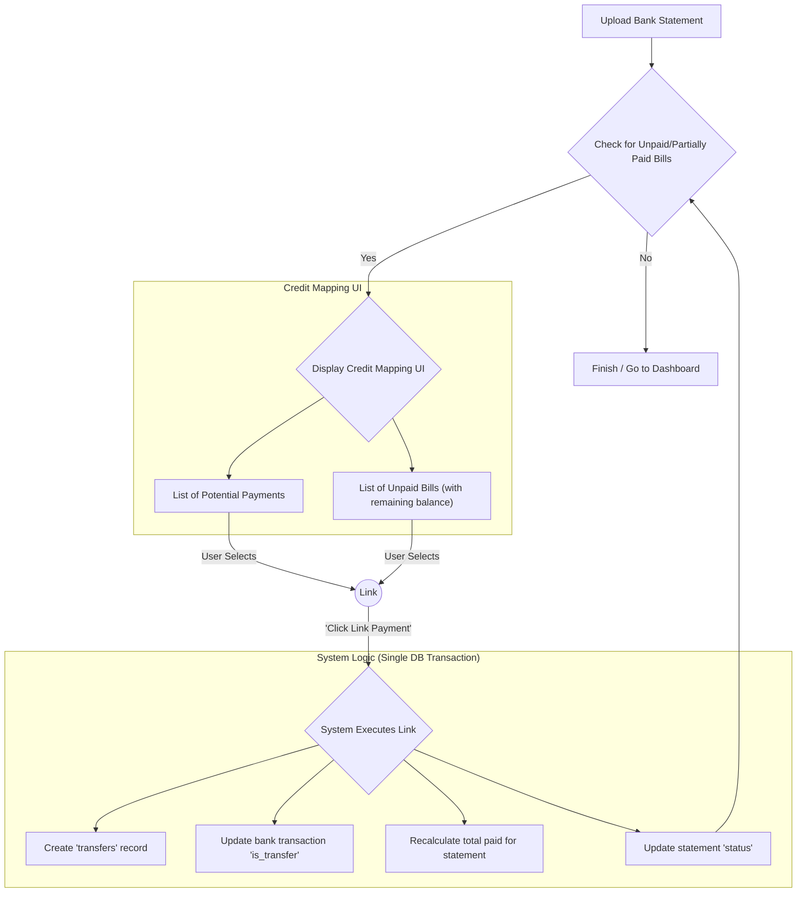
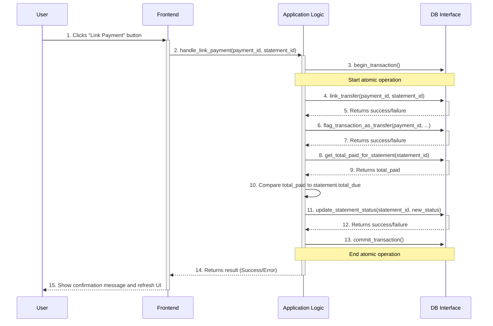

# Feature Architecture: Credit Mapping

**Author:** AI Architect
**Date:** July 24, 2025
**Version:** 1.0

## 1. Overview

This document provides the complete architecture for the **Credit Mapping** feature. The primary goal of this feature is to allow users to manually link credit card payments from their bank accounts to the corresponding credit card statements, thus preventing the double-counting of expenses. 

This architecture prioritizes simplicity, user control, and reliability over complex automation for its initial implementation. It is designed to be a robust foundation for potential future enhancements.

## 2. Core Concept: User-Driven Reconciliation

The core of this feature is a **manual reconciliation workflow** presented to the user within the application's UI. Instead of a complex backend engine trying to automatically find matches, the system will guide the user to make the connections themselves. This approach is simpler to build and more robust, as it leverages the user's own knowledge.

The workflow is centered around the lifecycle of a `card_statement`, which can be in one of three states: `UNPAID`, `PARTIALLY_PAID`, or `PAID`.

## 3. Database Schema Requirements

This feature requires the new `accounts`, `card_statements`, and `transfers` tables, as well as modifications to the `transactions` table.

*Reference: [Database Schema Architecture](db_model/schema_architecture.md)*

**Key Schema Addition:**

-   **`card_statements` table - Add `status` column:**
    -   `status` (String, NOT NULL, Default: `'UNPAID'`): Tracks the payment status of the statement. The possible values and their lifecycle are central to this feature:
        -   `UNPAID`: The initial state. No payments are linked.
        -   `PARTIALLY_PAID`: One or more payments are linked, but their sum is less than the statement's `total_due`.
        -   `PAID`: The sum of linked payments is greater than or equal to the `total_due`.

## 4. The Credit Mapping Workflow

### Step 1: System Becomes "Debt-Aware"
-   When a user uploads a credit card statement, a new record is created in the `card_statements` table with its `status` set to `'UNPAID'`.
-   The system now knows a specific bill is pending payment.

### Step 2: The Reconciliation UI is Triggered
-   The Credit Mapping UI is presented to the user whenever the system detects that there are statements in the `'UNPAID'` or `'PARTIALLY_PAID'` state. This check is performed after any statement (bank or credit card) is uploaded.

### Step 3: The User Creates the Link
-   The UI will present two lists:
    1.  **Potential Payments:** A list of unlinked, outgoing transactions from all bank accounts.
    2.  **Unpaid Bills:** A list of all `card_statements` with a status of `'UNPAID'` or `'PARTIALLY_PAID'`. The UI will clearly display the remaining balance for partially paid bills.
-   The user selects one item from each list and clicks a **"Link Payment"** button.

### Step 4: The System Executes the Link
-   Upon user confirmation, the system performs the following actions in a single, atomic database transaction:
    1.  Creates a new record in the `transfers` table.
    2.  Updates the selected bank transaction, setting `is_transfer = True`.
    3.  Recalculates the total amount paid towards the selected `card_statement`.
    4.  Updates the `card_statement`'s `status` to either `'PARTIALLY_PAID'` or `'PAID'` based on the new total.

## 5. High-Level Data and UI Flow

## 6. Component Interaction Sequence

This sequence diagram illustrates the order of operations between the frontend, the main application logic, and the database layer when a user links a payment.

This architecture provides a simple, robust, and user-centric solution for the Credit Mapping feature. It delivers immediate value while creating a solid foundation for future automation.
