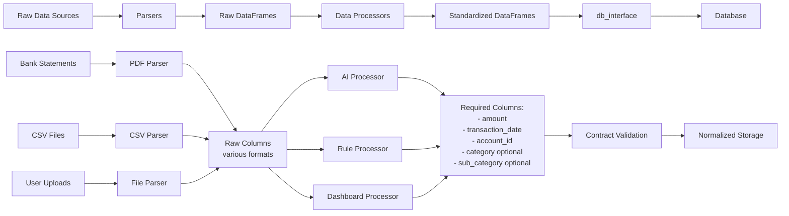

# ADR-003: DataFrame-Centric Database API

**Date:** January 15, 2025
**Status:** Adopted

## Context

The application needs to define the data interchange format between the database layer (`db_interface`) and all application components (frontend, processors, AI components). This decision affects how data flows through the entire system and impacts developer experience, performance, and integration capabilities.

Several approaches were considered:

1. **SQLAlchemy ORM Objects:** Return raw database model objects with foreign key relationships
2. **Raw Dictionaries:** Convert database records to simple Python dictionaries
3. **Custom Data Classes:** Create application-specific data structures
4. **pandas DataFrames:** Use DataFrames with denormalized, human-readable data

The choice significantly impacts AI/ML integration, data export/import capabilities, and application complexity.

## Decision

We will implement a **DataFrame-Centric Database API** where:

1. **All `get_*_table()` methods return pandas DataFrames** with denormalized data
2. **All `save_*_table()` methods accept pandas DataFrames** as input
3. **Foreign keys are replaced with human-readable names** (e.g., `category_id` becomes `category` + `sub_category` columns)
4. **The `db_interface` layer handles all denormalization/normalization** internally

## Rationale

### **Primary Benefits:**

-   **AI/ML Integration:** pandas DataFrames are the standard data structure for AI/ML workflows. This enables seamless integration with data processors and AI categorization without data conversion overhead.

-   **User-Friendly Data Export/Import:** Users can easily export data to CSV, edit in Excel, and re-import without understanding database foreign key relationships.

-   **Simplified Application Logic:** Frontend and processor components work with simple, flat data structures instead of navigating complex object relationships.

-   **Bulk Operation Performance:** DataFrames enable efficient batch operations and vectorized computations.

### **Design Principles:**

-   **Hide Database Complexity:** Application components never see foreign keys or need to understand table relationships
-   **Human-Readable Data:** All data uses names instead of IDs (e.g., "Food & Dining" instead of category_id=5)
-   **Consistent API:** All database operations follow the same DataFrame input/output pattern

## Alternatives Considered

### **Alternative 1: SQLAlchemy ORM Objects**
-   **Pros:** Type safety, automatic relationship loading, direct database mapping
-   **Cons:** Complex for AI/ML integration, requires SQLAlchemy knowledge throughout application, difficult data export
-   **Rejected Because:** Creates tight coupling between database schema and application logic

### **Alternative 2: Raw Dictionaries**
-   **Pros:** Simple, lightweight, JSON-serializable
-   **Cons:** No data validation, no vectorized operations, poor AI/ML integration
-   **Rejected Because:** Lacks the data manipulation capabilities needed for AI/ML workflows

### **Alternative 3: Custom Data Classes**
-   **Pros:** Type safety, application-specific design, clean interfaces
-   **Cons:** Additional complexity, poor AI/ML integration, requires custom serialization
-   **Rejected Because:** Adds abstraction layer without providing AI/ML benefits

## Consequences

### **Positive Consequences:**

-   **Seamless AI/ML Integration:** Data processors can directly work with DataFrames without conversion
-   **User-Friendly Experience:** Non-technical users can easily understand and manipulate exported data
-   **Simplified Testing:** Test data can be created as simple DataFrames without complex object setup
-   **Performance Benefits:** Bulk operations leverage pandas' optimized implementations

### **Negative Consequences:**

-   **Increased Memory Usage:** Denormalized data with repeated strings uses more memory than normalized foreign keys
-   **Denormalization Complexity:** The `db_interface` layer must handle complex denormalization logic
-   **Loss of Type Safety:** DataFrames use dynamic typing, losing compile-time type checking
-   **Potential Data Inconsistency:** Repeated names in denormalized data could become inconsistent if not properly managed

### **Mitigation Strategies:**

-   **Memory Management:** Use efficient data types and consider chunking for very large datasets
-   **Centralized Denormalization:** Keep all denormalization logic in `db_interface` to ensure consistency
-   **Data Validation:** Implement robust validation in `save_*_table()` methods to catch inconsistencies
-   **Performance Monitoring:** Monitor memory usage and query performance as data grows

## Implementation Notes

-   **Category Hierarchy:** Represented as `category` (parent) + `sub_category` (child) columns instead of foreign keys
-   **Account References:** Use `account_name` instead of `account_id` in transaction data
-   **Date Handling:** Ensure consistent datetime formatting across all DataFrames
-   **Error Handling:** Return structured `OperationResult`/`BatchOperationResult` objects, not DataFrame exceptions

## Input Contract Specification

The DataFrame-centric API establishes a **standardized data contract** between processors and the database layer:

### **Data Flow Architecture:**

### **Parser Responsibility:**
- **Extract** raw data from files (PDF, CSV, bank statements)
- **Convert** to basic DataFrame structure with original column names
- **Handle** file format specifics (encoding, delimiters, layouts)

### **Data Processor Responsibility:**
- **Transform** raw DataFrames into standardized DataFrame structure
- **Map** various column names to standard contract columns
- **Apply** business logic (AI categorization, rule-based processing)
- **Validate** data quality before sending to db_interface

### **db_interface Responsibility:**
- **Validate** DataFrame contract compliance (required columns)
- **Standardize** data types (string dates → datetime objects)
- **Enforce** business rules (category hierarchy, constraints)

This separation ensures that the database layer remains format-agnostic while processors handle the complexity of various data sources.