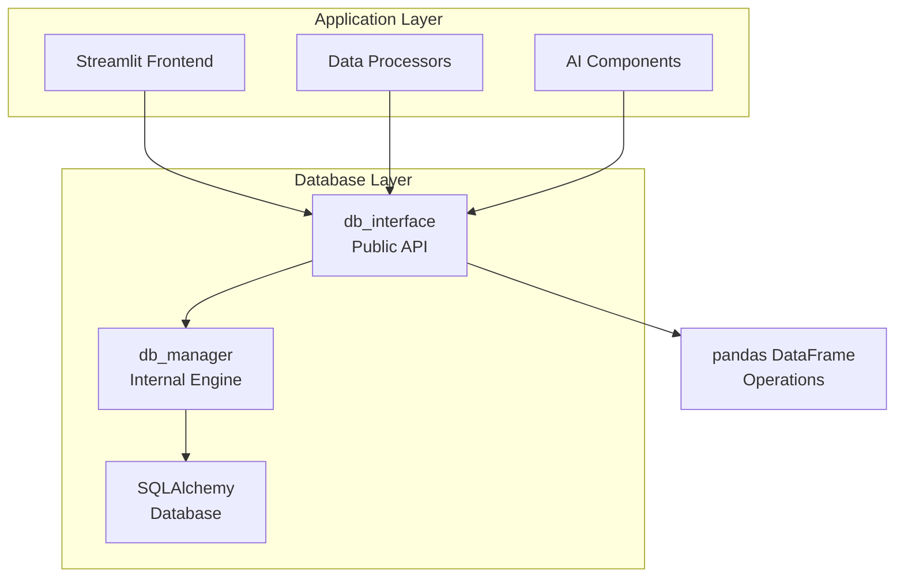
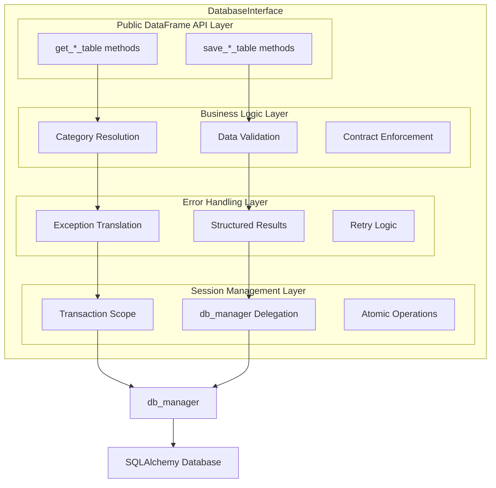

# Database Interface Micro-Architecture

**Component:** `core.database.db_interface.DatabaseInterface`  
**Last Updated:** 2025-01-15  
**Status:** IMPLEMENTED

---

## 1. **What & Why** *(2 minutes)*
**Purpose:** Public API layer that provides DataFrame-centric database operations while hiding SQLAlchemy complexity from application components.

**Key Decisions:**
- **DataFrame-Centric API**: All operations use pandas DataFrames for seamless AI/ML integration *(See [ADR-003-DataFrame-Centric-API](../db_model/ADR-003-DataFrame-Centric-API.md))*
- **Structured Error Results**: Returns `OperationResult`/`BatchOperationResult` instead of exceptions *(See [ADR-002-API-Error-Handling](../db_model/ADR-002-API-Error-Handling.md))*
- **Automatic Category Resolution**: Handles category hierarchy creation and resolution transparently
- **Denormalized Data Model**: Exposes simple category/sub_category columns instead of foreign keys

---

## 2. **Where It Fits** *(3 minutes)*


**Depends On:** db_manager, pandas, SQLAlchemy Session  
**Used By:** All application components (frontend, processors, AI components)

---

## 5. **Internal Structure**


**Critical Path:** DataFrame input → Data validation → Category resolution → db_manager operation → Error handling → Structured result  
**Performance Notes:** O(1) category resolution using optimized database queries, atomic batch operations

---

## 6. **Performance & Scalability**

| Operation | Complexity | Notes |
|-----------|------------|-------|
| `get_transactions_table()` | O(n) | Denormalizes all transactions with category names |
| `save_transactions_table()` | O(n) | Atomic batch operation with category auto-creation |
| `save_accounts_table()` | O(n) | Atomic batch account creation |
| `save_card_statements_table()` | O(n) | Atomic batch statement creation |
| `_resolve_category_id()` | O(1) | Optimized database query using indexes |
| `bulk_categorize_transactions()` | O(n*m) | n=transactions, m=rules, but uses optimized queries |

**Limits:**
- **Memory:** DataFrame operations load full result sets into memory
- **CPU:** Category resolution becomes bottleneck with complex hierarchies

**Performance Requirements:**
- Category resolution must use targeted database queries, not full table scans
- Batch operations must be atomic and use SQL bulk operations
- All save operations must return structured results with detailed error information

---

## 7. **Internal Testing**
```python
def test_dataframe_api_consistency():
    """Test that all get_*_table methods return consistent DataFrame structure."""
    # Test DataFrame column consistency
    pass

def test_atomic_batch_operations():
    """Test that batch operations are truly atomic."""
    # Test rollback behavior on partial failures
    pass

def test_category_resolution_performance():
    """Test O(1) category resolution performance."""
    # Verify no O(n) category fetching
    pass

def test_structured_error_handling():
    """Test that all operations return structured results."""
    # Test OperationResult/BatchOperationResult consistency
    pass
```

---

## 6. **Quick Reference**
```python
# Internal structure overview
class DatabaseInterface:
    def __init__(self, db_url: str = "sqlite:///expenses.db"):
        """Initialize with db_manager instance."""
        
    # DataFrame API Methods
    def get_transactions_table(self) -> pd.DataFrame:
        """Get denormalized transactions with category/sub_category columns."""
        
    def get_categories_table(self) -> pd.DataFrame:
        """Get categories with parent_category names (not IDs)."""
        
    def get_accounts_table(self, only_active: bool = False) -> pd.DataFrame:
        """Get accounts with all relevant fields."""
        
    def get_card_statements_table(self) -> pd.DataFrame:
        """Get card statements with account names."""
        
    # Batch Save Operations (BatchOperationResult)
    def save_transactions_table(self, df: pd.DataFrame) -> BatchOperationResult:
        """Atomic transaction save with auto-category creation."""
        
    def save_accounts_table(self, df: pd.DataFrame) -> BatchOperationResult:
        """Atomic account batch creation."""
        
    def save_card_statements_table(self, df: pd.DataFrame) -> BatchOperationResult:
        """Atomic statement batch creation."""
        
    def save_categories_table(self, df: pd.DataFrame) -> BatchOperationResult:
        """Atomic category creation with hierarchy support."""
        
    # Individual Operations (OperationResult)
    def update_account(self, account_id: int, new_data: Dict) -> OperationResult:
        """Update single account with structured result."""
        
    def link_transfer(self, payment_transaction_id: int, statement_id: int) -> OperationResult:
        """Create transfer link between payment and statement."""
        
    def flag_transaction_as_transfer(self, transaction_id: int) -> OperationResult:
        """Mark transaction as transfer."""
        
    # Category Management (OperationResult)
    def create_category_hierarchy(self, category_name: str, sub_category_name: str = "") -> OperationResult:
        """Create category hierarchy. Returns success/failure with structured result."""
        
    # Statistics & Metadata (OperationResult)
    def get_transactions_count(self) -> OperationResult:
        """Get total transaction count. Returns count in .data field."""
        
    def get_latest_transaction_timestamp(self) -> OperationResult:
        """Get most recent transaction timestamp. Returns timestamp in .data field."""
        
    # Transaction Management (OperationResult)
    def begin_transaction(self) -> OperationResult:
        """Begin new transaction context. Returns transaction_id in .data field."""
        
    def commit_transaction(self, transaction_id: str) -> OperationResult:
        """Commit transaction by ID."""
        
    def rollback_transaction(self, transaction_id: str) -> OperationResult:
        """Rollback transaction by ID."""
        
    # Bulk Operations (BatchOperationResult)
    def bulk_categorize_transactions(self, categorization_rules: List[Dict]) -> BatchOperationResult:
        """Apply categorization rules to multiple transactions."""
        
    # Internal Methods (Critical for Performance)
    def _resolve_category_id(self, category_name: str, sub_category_name: str, session: Optional[Session] = None) -> Optional[int]:
        """INTERNAL: O(1) category resolution using database indexes."""
        
    def _create_category_hierarchy_in_session(self, category_name: str, sub_category_name: str, session: Session) -> bool:
        """INTERNAL: Create category hierarchy within existing session for atomic operations."""
```

---

## **Return Type Standards (ADR-002 Compliance)**

### **Decision Matrix for Return Types:**

| Operation Type | Return Type | Rationale | Examples |
|----------------|-------------|-----------|----------|
| **Single Entity Operations** | `OperationResult` | One record, simple success/failure | `update_account()`, `link_transfer()` |
| **DataFrame Operations** | `BatchOperationResult` | Multiple records, partial success possible | `save_transactions_table()`, `save_accounts_table()` |
| **Metadata/Utility Operations** | `OperationResult` | Single value result | `get_transactions_count()`, `create_category_hierarchy()` |
| **Bulk Processing** | `BatchOperationResult` | Multiple operations, need success counts | `bulk_categorize_transactions()` |
| **Data Retrieval** | `pd.DataFrame` | Direct data access, no error wrapping needed | `get_transactions_table()`, `get_categories_table()` |

### **Result Structure Definitions:**

#### **OperationResult (Single Operations)**
```python
@dataclass
class OperationResult:
    success: bool                        # Operation succeeded
    data: Optional[Any] = None           # Single value (count, ID, timestamp, object)
    error_message: Optional[str] = None  # Human-readable error description
    error_type: Optional[str] = None     # Error category for handling
    is_retryable: bool = False          # Whether operation can be retried
    affected_rows: int = 0              # Number of database rows affected (0 or 1)

# Usage Examples:
# result.data = 150                    # For get_transactions_count()
# result.data = datetime(...)          # For get_latest_transaction_timestamp()
# result.data = "txn_12345"           # For begin_transaction()
```

#### **BatchOperationResult (Multiple Operations)**
```python
@dataclass
class BatchOperationResult:
    success: bool                        # All operations succeeded
    data: Optional[List[Any]] = None     # List of created/updated objects
    error_message: Optional[str] = None  # Human-readable error description
    error_type: Optional[str] = None     # Error category for handling
    is_retryable: bool = False          # Whether batch can be retried
    successful_count: int = 0           # Number of successful operations
    failed_count: int = 0               # Number of failed operations
    total_count: int = 0                # Total operations attempted

# Usage Examples:
# result.successful_count = 95         # 95 transactions saved successfully
# result.failed_count = 5              # 5 transactions failed validation
# result.data = [transaction_objects]  # List of created Transaction objects
```

### **Comprehensive Exception Handling (ADR-002 Compliant):**
- **Universal catch-all pattern**: All methods use `except Exception as e:` to prevent any exception leakage
- **Sophisticated error classification**: `handle_constraint_error()` processes ALL exception types (SQLAlchemy, Python, unexpected)
- **Structured translation**: Every exception becomes a structured OperationResult/BatchOperationResult
- **Consistent error information**: All errors include error_message, error_type, and retry guidance
- **No exceptions leak**: Guaranteed by comprehensive Exception catch blocks in every operation
- **Partial failure handling**: Batch operations capture detailed success/failure counts

### **Known Limitations & Testing Requirements:**

#### **Scalability Limitation:**
- **DataFrame operations** load full datasets into memory
- **No pagination** in current API design (acceptable for small-medium datasets)
- **Future enhancement:** Add `limit`/`offset` parameters when needed

#### **Session Management Risk:**
- **Forgotten session parameter** causes auto-commit instead of transaction participation
- **Testing requirement:** Stringent tests needed to detect partial commit scenarios
- **Mitigation:** Comprehensive test coverage for multi-step operations

---

## **Configuration & Initialization**

### **Timezone Handling**
```python
# All timestamps use Indian Standard Time
indian_timezone = pytz.timezone("Asia/Kolkata")

# Automatic timezone localization in save operations
if transaction_date.tzinfo is None:
    transaction_date = indian_timezone.localize(transaction_date)
```

### **Input Contract Validation**
```python
# DataFrame contract validation - ensures data processors send correct format
required_cols = ['amount', 'transaction_date', 'account_id']
missing_cols = [col for col in required_cols if col not in df.columns]
if missing_cols:
    return BatchOperationResult(
        success=False,
        error_message=f"Missing required columns: {missing_cols}"
    )

# Standardized data type conversion - processors can send various formats
if isinstance(transaction_date, str):
    transaction_date = pd.to_datetime(transaction_date).to_pydatetime()
elif isinstance(transaction_date, pd.Timestamp):
    transaction_date = transaction_date.to_pydatetime()

# Contract: Data processors must transform raw DataFrames into this standardized format
# - Raw files → Parser → Raw DataFrame → Data Processor → Standardized DataFrame → db_interface
# - Bank statements → PDF Parser → Raw columns → AI Processor → Standardized DataFrame → db_interface
# - CSV uploads → CSV Parser → Raw columns → Rule Processor → Standardized DataFrame → db_interface
```

### **Database Engine Setup**
```python
# Engine initialization with SQLite optimization
def __init__(self, db_url: str = "sqlite:///expenses.db"):
    self.db = Database(db_url)
    # Database handles connect_args for SQLite thread safety
```

---

## **Key Implementation Patterns**

### **Pattern 1: DataFrame Denormalization**

```
DataFrame Denormalization Flow:
┌─────────────────┐    ┌─────────────────┐    ┌─────────────────┐
│   SQLAlchemy    │───▶│   Join &        │───▶│   DataFrame     │
│   ORM Objects   │    │   Transform     │    │   with Names    │
└─────────────────┘    └─────────────────┘    └─────────────────┘

Key Transformations:
├─ category_id → category + sub_category names
├─ account_id → account_name  
├─ Foreign keys → Human-readable names
└─ Hierarchical data → Flat columns

Benefits:
- AI/ML components work with simple DataFrames
- No foreign key complexity in application layer
- Easy to export/import via CSV
```

### **Pattern 1.5: Critical Internal Methods**
```
Internal Category Resolution (_resolve_category_id):
┌─────────────────┐    ┌─────────────────┐    ┌─────────────────┐
│   category +    │───▶│   Targeted      │───▶│   category_id   │
│   sub_category  │    │   SQL Query     │    │   or None       │
└─────────────────┘    └─────────────────┘    └─────────────────┘

Strategy:
IF sub_category provided:
  1. Query: SELECT id FROM categories WHERE name=sub_category AND parent_id=(
       SELECT id FROM categories WHERE name=category AND parent_id IS NULL)
ELSE:
  1. Query: SELECT id FROM categories WHERE name=category AND parent_id IS NULL

Performance: O(1) using database indexes vs O(n) Python iteration

Internal Hierarchy Creation (_create_category_hierarchy_in_session):
┌─────────────────┐    ┌─────────────────┐    ┌─────────────────┐
│   Category      │───▶│   Check/Create  │───▶│   Check/Create  │
│   Names         │    │   Parent        │    │   Child         │
└─────────────────┘    └─────────────────┘    └─────────────────┘

Atomicity: All operations within provided session (caller manages transaction)
Error Handling: Returns boolean success, lets exceptions propagate for rollback
```

### **Pattern 2: Optimized Category Resolution**
```
Category Resolution Strategy:
┌─────────────────┐    ┌─────────────────┐    ┌─────────────────┐
│   category +    │───▶│   Targeted      │───▶│   category_id   │
│   sub_category  │    │   DB Query      │    │   or None       │
└─────────────────┘    └─────────────────┘    └─────────────────┘

Performance Optimization:
OLD: get_all_categories() + Python iteration (O(n))
NEW: db.get_category_by_name() with SQL WHERE clause (O(1))

Auto-Creation Flow:
IF category not found:
  1. Create parent category (if needed)
  2. Create child category (if needed)  
  3. Re-resolve category_id
  4. Continue with transaction
```

### **Pattern 3: Atomic Batch Operations**

```
Atomic Batch Operation Flow:
┌─────────────────┐    ┌─────────────────┐    ┌─────────────────┐
│   DataFrame     │───▶│   Validate &    │───▶│   Start         │
│   Input         │    │   Transform     │    │   Transaction   │
└─────────────────┘    └─────────────────┘    └─────────────────┘
                                                       │
┌─────────────────┐    ┌─────────────────┐    ┌───────▼─────────┐
│   Structured    │◀───│   Commit or     │◀───│   Process All   │
│   Result        │    │   Rollback      │    │   Records       │
└─────────────────┘    └─────────────────┘    └─────────────────┘

Key Principles:
- Use transaction_scope() context manager
- Process all records before committing
- Auto-create categories within same transaction
- Return detailed success/failure information
```

### **Pattern 4: Structured Error Translation**
```
Error Translation Flow:
┌─────────────────┐    ┌─────────────────┐    ┌─────────────────┐
│   SQLAlchemy    │───▶│   Classify &    │───▶│   Structured    │
│   Exception     │    │   Translate     │    │   Result Object │
└─────────────────┘    └─────────────────┘    └─────────────────┘

Translation Strategy:
try:
    # db_manager operation
    result = self.db.operation(data, session=session)
    return OperationResult(success=True, ...)
except Exception as e:
    error_info = self.db.handle_constraint_error(e)
    return OperationResult(
        success=False,
        error_message=error_info['error_message'],
        error_type=error_info['error_type'],
        is_retryable=self.db.is_retryable_error(e)
    )

Result Types:
- OperationResult: Single operations
- BatchOperationResult: Batch operations with counts
```

### **Pattern 5: Session Management Delegation**
```
Session Management Pattern:
┌─────────────────┐    ┌─────────────────┐    ┌─────────────────┐
│   Public API    │───▶│   transaction_  │───▶│   db_manager    │
│   Method        │    │   scope()       │    │   Operation     │
└─────────────────┘    └─────────────────┘    └─────────────────┘

Pattern Usage:
def save_operation(self, df: pd.DataFrame) -> OperationResult:
    try:
        with self.db.transaction_scope() as session:
            # All operations within this block are atomic
            result = self.db.batch_operation(data, session=session)
        return OperationResult(success=True, ...)
    except Exception as e:
        # Handle and translate error
        return OperationResult(success=False, ...)

Benefits:
- Automatic transaction management
- Consistent error handling
- No manual session cleanup required
```