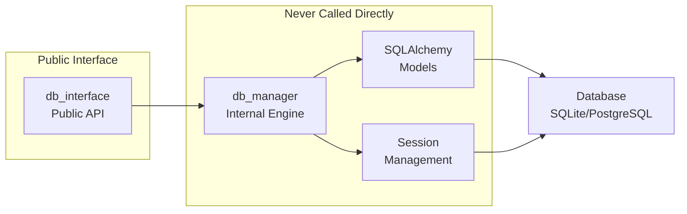
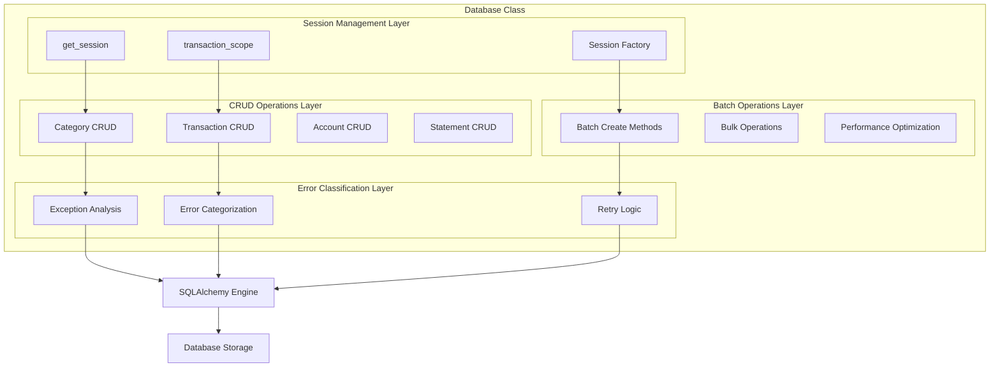
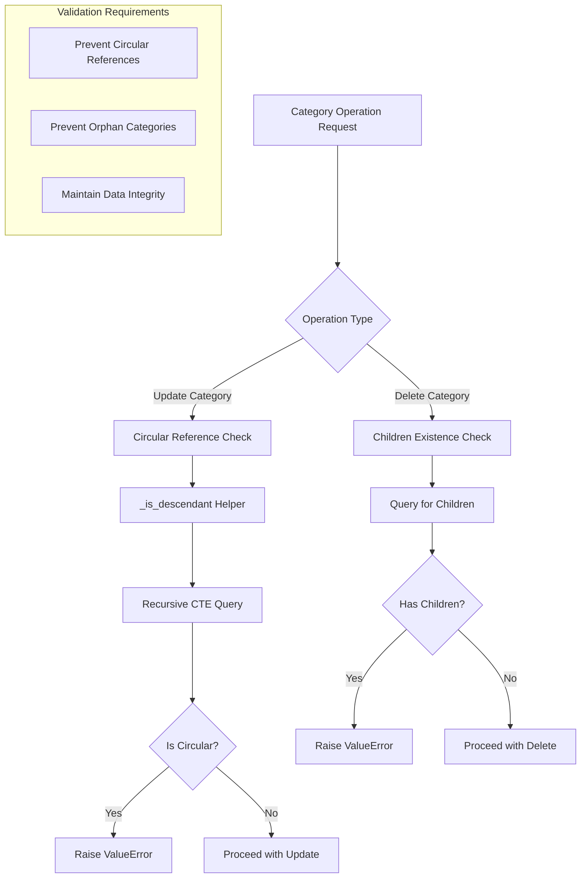

# Database Manager Micro-Architecture

**Component:** `core.database.db_manager.Database`  
**Last Updated:** 2025-07-30  
**Status:** IMPLEMENTED

---

## 1. **What & Why** *(2 minutes)*
**Purpose:** Internal database engine that executes raw SQLAlchemy operations with session management and transaction control.

**Key Decisions:**
- **Dual Session Pattern**: Supports both auto-managed sessions and externally-managed sessions for atomic operations *(See [ADR-001-Dual-Session-Management](../db_model/ADR-001-Dual-Session-Management.md))*
- **Raw ORM Operations**: Returns SQLAlchemy model objects, not structured results (that's db_interface's job)
- **Exception Propagation**: Lets SQLAlchemy exceptions bubble up for db_interface to handle *(See [ADR-002-API-Error-Handling](../db_model/ADR-002-API-Error-Handling.md))*

---

## 2. **Where It Fits** *(3 minutes)*


**Depends On:** SQLAlchemy, model.py, pytz  
**Used By:** db_interface only (never called directly by application code)

---

## 5. **Internal Structure**


**Critical Path:** Session creation → Raw operation → Exception handling → Session cleanup  
**Performance Notes:** Uses session pooling and batch operations for efficiency

---

## 6. **Performance & Scalability**

| Operation | Complexity | Notes |
|-----------|------------|-------|
| `create_transaction()` | O(1) | Single insert with auto-commit |
| `create_transactions_batch()` | O(n) | Bulk insert, much faster than individual |
| `create_accounts_batch()` | O(n) | Atomic bulk account creation |
| `create_card_statements_batch()` | O(n) | Atomic bulk statement creation |
| `get_all_transactions()` | O(n) | Full table scan, use filtering for large datasets |
| `get_transactions_filtered()` | O(log n) | Uses database indexes |
| `get_category_by_name()` | O(1) | Optimized category lookup with database indexes |

**Limits:**
- **Memory:** Batch operations load all results into memory
- **CPU:** Complex queries with joins become bottleneck at ~10k+ records

**Performance Requirements:**
- Category resolution must be O(1) using targeted database queries
- Batch operations must use SQL bulk operations, not Python loops
- All query methods should leverage database indexes for optimal performance

---

## 7. **Internal Testing**
```python
def test_dual_session_pattern():
    """Test that session management works correctly."""
    # Test auto-managed session
    category = db.create_category("Test")
    assert category.id is not None
    
    # Test externally-managed session
    with db.transaction_scope() as session:
        category2 = db.create_category("Test2", session=session)
        # Should not be committed yet
        assert category2.id is not None

def test_error_classification():
    """Test error handling and classification."""
    try:
        # Create duplicate category to trigger constraint error
        db.create_category("Duplicate")
        db.create_category("Duplicate")
    except Exception as e:
        error_info = db.handle_constraint_error(e)
        assert error_info['error_category'] == 'constraint_violation'
        assert not db.is_retryable_error(e)
```

---

## 6. **Quick Reference**
```python
# Internal structure overview
class Database:
    def __init__(self, db_url: str = "sqlite:///expenses.db"):
        """Initialize with engine and session factory."""
        
    def get_session(self) -> Session:
        """INTERNAL: Creates new session for single operations."""
        
    @contextmanager
    def transaction_scope(self) -> Session:
        """INTERNAL: Provides atomic transaction context."""
        
    # CRUD Operations
    def create_category(self, name: str, session: Optional[Session] = None) -> model.Category:
        """INTERNAL: Raw category creation."""
        
    def create_transaction(self, amount: float, transaction_date: datetime, account_id: int, session: Optional[Session] = None) -> model.Transaction:
        """INTERNAL: Raw transaction creation."""
        
    def create_account(self, name: str, account_type: str, session: Optional[Session] = None) -> model.Account:
        """INTERNAL: Raw account creation."""
        
    def create_card_statement(self, account_id: int, statement_date: date, session: Optional[Session] = None) -> model.CardStatement:
        """INTERNAL: Raw card statement creation."""
        
    # Batch Operations
    def create_transactions_batch(self, transactions_data: List[Dict], session: Optional[Session] = None) -> List[model.Transaction]:
        """INTERNAL: Atomic batch transaction creation."""
        
    def create_categories_batch(self, categories_data: List[Dict], session: Optional[Session] = None) -> List[model.Category]:
        """INTERNAL: Atomic batch category creation."""
        
    def create_accounts_batch(self, accounts_data: List[Dict], session: Session) -> List[model.Account]:
        """INTERNAL: Atomic batch account creation."""
        
    def create_card_statements_batch(self, statements_data: List[Dict], session: Optional[Session] = None) -> List[model.CardStatement]:
        """INTERNAL: Atomic batch statement creation."""
        
    # Optimized Query Methods
    def get_category_by_name(self, name: str, parent_name: Optional[str] = None, session: Optional[Session] = None) -> Optional[model.Category]:
        """INTERNAL: O(1) category lookup using database indexes."""
        
    def get_transactions_filtered(self, date_range: Optional[tuple] = None, categories: Optional[List[str]] = None, session: Optional[Session] = None) -> List[model.Transaction]:
        """INTERNAL: Filtered transaction queries with database-level filtering."""
        
    # Error Classification
    def handle_constraint_error(self, error: Exception) -> Dict[str, Any]:
        """INTERNAL: Classifies all database and validation errors for db_interface."""
        
    def is_retryable_error(self, error: Exception) -> bool:
        """INTERNAL: Determines if error can be retried."""
        
    # Statistics & Metadata Operations
    def get_transactions_count(self) -> int:
        """INTERNAL: Get total transaction count for statistics."""
        
    def get_latest_transaction_timestamp(self) -> Optional[datetime.datetime]:
        """INTERNAL: Get most recent transaction timestamp."""
        
    # Additional CRUD Operations
    def get_all_accounts(self, only_active: bool = False) -> List[model.Account]:
        """INTERNAL: Get all accounts with optional active filter."""
        
    def get_all_card_statements(self) -> List[model.CardStatement]:
        """INTERNAL: Get all card statements."""
        
    def update_transaction(self, transaction_id: int, new_data: Dict, session: Optional[Session] = None) -> Optional[model.Transaction]:
        """INTERNAL: Update single transaction with new data."""
        
    def update_category(self, category_id: int, new_data: Dict[str, Any], session: Optional[Session] = None) -> Optional[model.Category]:
        """INTERNAL: Update category with circular reference validation."""
        
    def update_account(self, account_id: int, new_data: Dict, session: Optional[Session] = None) -> Optional[model.Account]:
        """INTERNAL: Update single account with new data."""
        
    def update_card_statement(self, statement_id: int, new_data: Dict, session: Optional[Session] = None) -> Optional[model.CardStatement]:
        """INTERNAL: Update single card statement with new data."""
        
    # Delete Operations
    def delete_category(self, category_id: int, session: Optional[Session] = None) -> bool:
        """INTERNAL: Delete category. Raises ValueError if category has children."""
        
    def delete_transaction(self, transaction_id: int, session: Optional[Session] = None) -> bool:
        """INTERNAL: Delete single transaction."""
        
    # Validation Helper Methods
    def _is_descendant(self, potential_child_id: int, potential_parent_id: int, session: Session) -> bool:
        """INTERNAL: Check if category is descendant using recursive CTE query to prevent circular references."""
```

## **Key Implementation Patterns**

### **Pattern 1: Dual Session Management**
*For detailed rationale, see [ADR-001-Dual-Session-Management](../db_model/ADR-001-Dual-Session-Management.md)*

### **Pattern 2: Batch Operation Optimization**
```python
def create_transactions_batch(self, transactions_data: List[Dict], session: Optional[Session] = None):
    """Optimized batch creation with proper session handling."""
    # Validate input
    if not transactions_data:
        return []
    
    # Use provided session or create new one
    db = session if session is not None else self.get_session()
    created_objects = []
    
    try:
        # Bulk create objects
        for data in transactions_data:
            obj = model.Transaction(**data)
            db.add(obj)
            created_objects.append(obj)
        
        # Commit or flush based on session management
        if session is None:
            db.commit()
            # Refresh to get IDs
            for obj in created_objects:
                db.refresh(obj)
        else:
            db.flush()
            for obj in created_objects:
                db.refresh(obj)
                
        return created_objects
    except Exception as e:
        if session is None:
            db.rollback()
        raise
```

### **Pattern 3: Comprehensive Error Classification**
*For detailed error handling strategy, see [ADR-002-API-Error-Handling](../db_model/ADR-002-API-Error-Handling.md)*

```
Error Classification Flow:
┌─────────────────┐    ┌─────────────────┐    ┌─────────────────┐
│   Exception     │───▶│   Classify      │───▶│   Structured    │
│   Received      │    │   Error Type    │    │   Error Info    │
└─────────────────┘    └─────────────────┘    └─────────────────┘

Error Categories to Handle:
├─ SQLAlchemy Errors
│  ├─ IntegrityError → constraint_violation
│  ├─ DataError → data_type_error  
│  └─ OperationalError → operational_error
└─ Python Validation Errors
   ├─ ValueError → data_validation_error
   └─ TypeError → data_validation_error

Output Structure:
{
  error_type: string,
  error_category: string,
  is_retryable: boolean,
  suggested_action: string,
  constraint_type?: string  // for constraint violations
}
```

### **Pattern 4: Optimized Category Resolution**
```
Category Resolution Strategy:
┌─────────────────┐    ┌─────────────────┐    ┌─────────────────┐
│   Category      │───▶│   Database      │───▶│   Category      │
│   Name + Parent │    │   Index Query   │    │   Object        │
└─────────────────┘    └─────────────────┘    └─────────────────┘

Query Strategy:
IF parent_name provided:
  1. Query parent by name WHERE parent_id IS NULL
  2. Query child by name WHERE parent_id = parent.id
ELSE:
  1. Query category by name WHERE parent_id IS NULL

Performance: O(1) using database indexes
Replaces: O(n) get_all_categories + iteration
```

### **Pattern 5: Atomic Batch Operations**
```
Batch Operation Flow:
┌─────────────────┐    ┌─────────────────┐    ┌─────────────────┐
│   Input Data    │───▶│   Validate &    │───▶│   Create ORM    │
│   List[Dict]    │    │   Transform     │    │   Objects       │
└─────────────────┘    └─────────────────┘    └─────────────────┘
                                                       │
┌─────────────────┐    ┌─────────────────┐    ┌───────▼─────────┐
│   Return        │◀───│   Flush &       │◀───│   Add to        │
│   Objects       │    │   Refresh       │    │   Session       │
└─────────────────┘    └─────────────────┘    └─────────────────┘

Key Principles:
- Use provided session (caller manages transaction)
- Flush but don't commit (atomic with other operations)
- Refresh objects to get database-generated IDs
- Let exceptions propagate for proper rollback
```

### **Pattern 6: Robust Category Validation**


**Critical Validation Logic:**
- **Circular Reference Prevention**: Uses recursive CTE query to detect if new parent would create circular dependency
- **Orphan Prevention**: Explicitly checks for child categories before allowing deletion
- **Database-Level Validation**: Leverages SQL recursive queries for performance and accuracy
- **Exception-Based Contract**: Raises ValueError for validation failures (not silent failures)

**Key Methods:**
- `_is_descendant()`: Recursive CTE query to check parent-child relationships
- `update_category()`: Validates against circular references before updating parent_id
- `delete_category()`: Validates no children exist before deletion