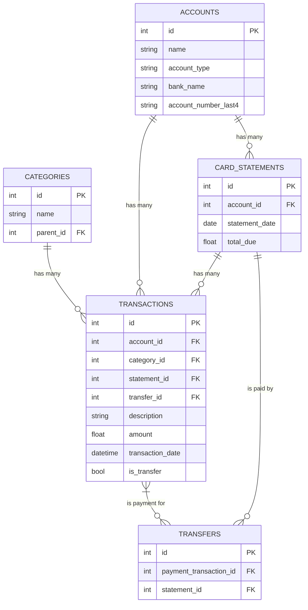

# Database Schema Architecture

**Author:** AI Architect
**Date:** July 24, 2025
**Version:** 1.0

## 1. Overview

This document provides the definitive architecture for the application's database schema. It includes the existing tables (`categories`, `transactions`) and integrates the new tables (`accounts`, `card_statements`, `transfers`) required to support the transfer-matching feature. This schema is designed to be robust, scalable, and auditable.

## 2. Table Definitions

### 2.1. `categories`
Stores user-defined expense categories in a hierarchical structure.

-   `id` (INTEGER, Primary Key)
-   `name` (String, NOT NULL)
-   `parent_id` (INTEGER, FK to `categories.id`, Nullable)
-   `created_at` (DateTime)
-   `updated_at` (DateTime)

### 2.2. `transactions`
Stores all individual financial transactions from all accounts.

-   `id` (INTEGER, Primary Key)
-   `description` (String, Nullable)
-   `amount` (Numeric, NOT NULL)
-   `transaction_date` (DateTime, NOT NULL)
-   `category_id` (INTEGER, FK to `categories.id`, Nullable)
-   `embedding` (Text, Nullable) - *For AI-powered semantic search.*
-   `created_at` (DateTime)
-   `updated_at` (DateTime)
-   **`account_id`** (INTEGER, FK to `accounts.id`, NOT NULL)
-   **`statement_id`** (INTEGER, FK to `card_statements.id`, Nullable)
-   **`is_transfer`** (BOOLEAN, Default: `False`, NOT NULL)
-   **`transfer_id`** (INTEGER, FK to `transfers.id`, Nullable)

### 2.3. `accounts`
Stores user-defined financial accounts, such as bank accounts or credit cards. This is the central entity for linking all data.

-   `id` (INTEGER, Primary Key)
-   `name` (String, NOT NULL, UNIQUE) - *e.g., "HDFC Regalia", "ICICI Savings"*
-   `account_type` (String, NOT NULL) - *e.g., 'Credit Card', 'Bank Account'*
-   `bank_name` (String, Nullable)
-   `account_number_last4` (String, Nullable)
-   `is_active` (BOOLEAN, NOT NULL, Default: `True`) - *For soft deletion. Closed accounts are marked as inactive.*
-   `file_fingerprint` (String, Nullable, UNIQUE) - *Stores a hash of a CSV file's column structure for auto-detection.*
-   `created_at` (DateTime)
-   `updated_at` (DateTime)

### 2.4. `card_statements`
Stores metadata for each uploaded credit card statement.

-   `id` (INTEGER, Primary Key)
-   `account_id` (INTEGER, FK to `accounts.id`, NOT NULL)
-   `statement_date` (Date, NOT NULL) - *The closing date of the statement.*
-   `start_date` (Date, Nullable)
-   `end_date` (Date, Nullable)
-   `total_due` (Numeric, Nullable)
-   `created_at` (DateTime)
-   `updated_at` (DateTime)

### 2.5. `transfers`
Creates an auditable link between a payment from a bank account and the credit card statement it pays off.

-   `id` (INTEGER, Primary Key)
-   `payment_transaction_id` (INTEGER, FK to `transactions.id`, NOT NULL, UNIQUE)
-   `statement_id` (INTEGER, FK to `card_statements.id`, NOT NULL)
-   `matched_rule` (String, Nullable) - *e.g., "Amount and Date Match"*
-   `created_at` (DateTime)
-   `updated_at` (DateTime)

## 3. Entity Relationship Diagram

