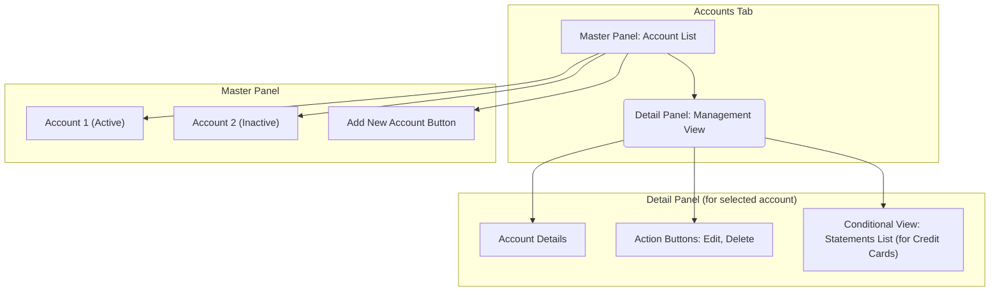

# Frontend Micro-Architecture: Accounts Tab

**Author:** AI Architect
**Date:** July 31, 2025
**Status:** Finalized
**Version:** 1.0

## 1. Component Overview

This document provides the micro-architecture for the **Accounts Tab**. This tab serves as the central hub for users to manage their financial accounts and view associated statement information.

The design prioritizes clarity and ease of use, employing a master-detail pattern to allow users to navigate their accounts and manage them efficiently.

## 2. Core Concept: Master-Detail Layout

The UI will be organized into two main panels:

*   **Master Panel (Account List):** A vertically arranged list on the left side of the tab. This panel will display all user-created accounts and serve as the primary navigation.
*   **Detail Panel (Management View):** The main content area of the tab. This panel will display the details and available actions for the single account selected from the master list.

## 3. Feature Breakdown

### 3.1. Account Management (CRUD)

This is the primary function of the tab, handled via the master and detail panels.

*   **Create:**
    *   A prominent "Add Account" button will be present in the master panel.
    *   Clicking it will open a modal dialog (`st.dialog`) containing a form to create a new account. The form will include fields for `Account Name`, `Account Type` (Bank Account/Credit Card), etc.

*   **Read:**
    *   The master panel will list all accounts.
    *   Each item will display the account name and an icon indicating its type.
    *   Inactive accounts (soft-deleted) will be visually distinguished (e.g., grayed out).

*   **Update:**
    *   When an account is selected, its details will appear in the detail panel with an "Edit" button.
    *   Clicking "Edit" will open the same creation form, pre-filled with the account's current data.

*   **Delete (Soft Delete):**
    *   The detail panel will contain a "Delete" button.
    *   Clicking it will trigger a confirmation dialog to prevent accidental deletion.
    *   On confirmation, the system will set the account's `is_active` flag to `False`. The account will remain in the database but will be treated as inactive throughout the application.

### 3.2. Statement Management (Conditional View)

The detail panel will display different information based on the selected account's type.

*   **For 'Bank Account' type:**
    *   The view will be simple, showing only the account details and the Edit/Delete actions.

*   **For 'Credit Card' type:**
    *   In addition to the standard details, a new section titled **"Uploaded Statements"** will appear.
    *   This section will contain a table listing all `card_statement` records associated with this account.
    *   **Table Columns:**
        *   `Statement Date`: The closing date of the bill.
        *   `Total Due`: The total amount of the bill.
        *   `Status`: The payment status (`UNPAID`, `PARTIALLY_PAID`, `PAID`), providing a clear view of what is outstanding.
    *   **Actions:** Each statement in the list will have a "Delete" action, which will trigger a strong warning before allowing the user to perform a cascading soft-delete of the statement and its associated transactions.

This architecture provides a robust and intuitive interface for all account and statement management tasks.
