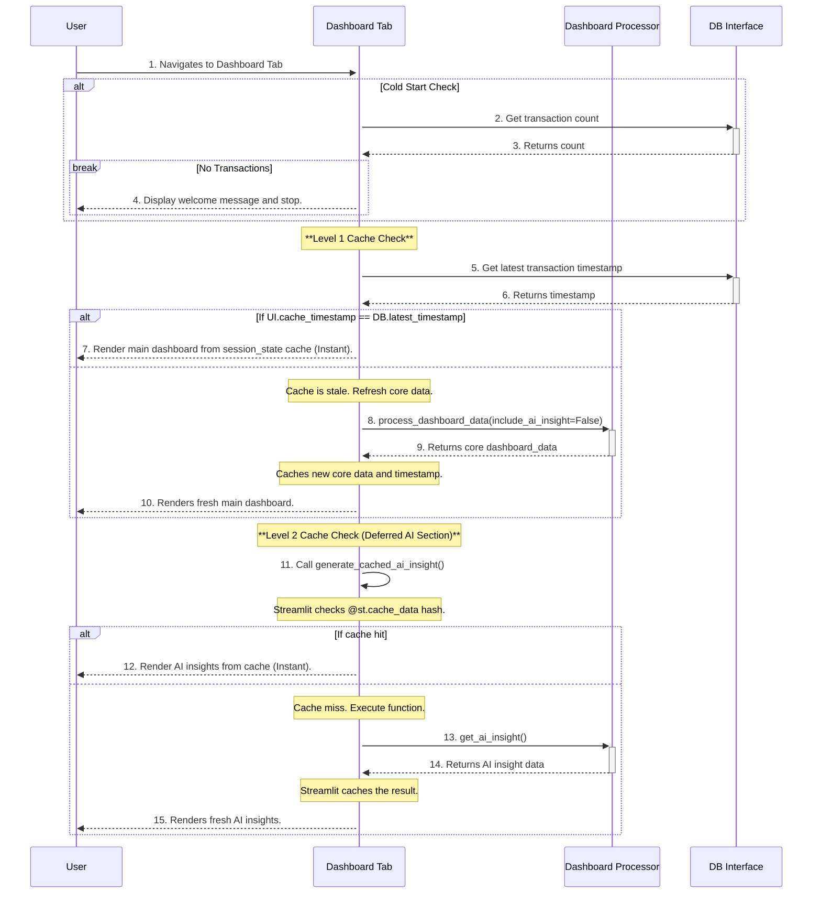

# Frontend Micro-Architecture: Dashboard Tab

**Author:** AI Architect
**Date:** July 24, 2025
**Status:** Final
**Version:** 2.0

## 1. Component Overview

This document provides the detailed micro-architecture for the **Dashboard Tab**. This tab serves as the main landing page, offering the user an at-a-glance overview of their financial status, key spending trends, and AI-powered insights.

**Version 2.0 Update:** This version formalizes the **two-level caching strategy** and the **deferred rendering** of AI components to ensure a highly responsive user experience.

This design adheres to the principles outlined in the main `frontend_micro_architecture.md` and `system_architecture.md` documents.

## 2. Responsibilities

-   Handle the "cold start" or empty state by displaying a welcoming message when no transaction data is present.
-   Intelligently determine the month to display based on the most recent available transaction data (the "Target Month").
-   Conditionally display an alert if the data being shown is not from the current calendar month.
-   Display high-level Key Performance Indicators (KPIs) for the Target Month.
-   Present a clear visualization of expenses by category for the Target Month.
-   Show a historical view of spending over the last few months.
-   **Deferredly render** the AI-generated summary to avoid blocking the initial dashboard load.
-   Provide a list of the most recent transactions for immediate context.
-   Ensure the dashboard is clean, easy to read, and loads efficiently by employing a robust, multi-level caching strategy.

## 3. Caching Strategy: Two-Level System

To ensure a fast and responsive user experience, the dashboard employs a two-level caching system.

### Level 1: Manual Session Caching (Core Data)
This cache stores the primary data required for rendering the main dashboard (KPIs, chart data, etc.).

-   **Mechanism:** Uses `st.session_state` to hold the data (`st.session_state.dashboard_data`).
-   **Cache Invalidation:** This cache is invalidated **manually**. The UI fetches the `last_transaction_timestamp` from the database on each run. If this timestamp differs from the one stored in the session state, the cache is considered stale, and the core data is re-processed. This is a highly efficient, targeted invalidation scheme.

### Level 2: Automated Function Caching (AI Insights)
This cache stores the results of the expensive AI insight generation call.

-   **Mechanism:** Uses Streamlit's built-in **`@st.cache_data`** decorator on the function that calls the AI processor.
-   **Cache Invalidation:** This cache is invalidated **automatically** by Streamlit. Before executing the function, Streamlit creates a hash of its inputs, including:
    1.  The input arguments to the function (in this case, the `ai_insight_data` DataFrame).
    2.  The code of the decorated function itself.
    3.  The code of any functions used inside the decorated function.
-   If this hash matches the hash from a previous run, Streamlit skips the function execution and returns the cached result instantly. If the hash is different (e.g., the input data has changed), the function is executed, and its result is cached for future use.

## 4. Component Logic and Sequence

This sequence outlines the deferred rendering and two-level caching logic.

## 5. Feature Breakdown

### 5.1. Key Performance Indicators (KPIs)
-   **Description:** A row of 3-4 prominent, non-interactive stats for the Target Month.
-   **Required Data:** `total_spend`, `top_category`, `largest_transaction`.
-   **Implementation:** Use `st.metric` for a clean, clear display.

### 5.2. Expense by Category Chart
-   **Description:** A donut or pie chart showing the proportional split of spending across parent categories for the Target Month.
-   **Required Data:** A DataFrame with `category` and `amount` columns, pre-aggregated by the `Dashboard Processor`.
-   **Implementation:** Use `st.plotly_chart` or a similar library.

### 5.3. Spending Over Time Chart
-   **Description:** A bar chart showing total monthly spending for the last 6 months.
-   **Required Data:** A DataFrame with `month` and `total_amount` columns, pre-aggregated by the `Dashboard Processor`.
-   **Implementation:** Use `st.bar_chart`.

### 5.4. AI-Powered Insights
-   **Description:** A text-based section to display the AI-generated overview and insights.
-   **Implementation:** This component is rendered **deferredly** (after the main dashboard) to ensure a fast initial load. The data generation for this component is wrapped in a **`@st.cache_data`** function to prevent re-computation on every render.

### 5.5. Recent Transactions
-   **Description:** A simple, scrollable table showing the 5-10 most recent transactions.
-   **Required Data:** A DataFrame slice of the most recent transactions.
-   **Implementation:** Use `st.dataframe`.

## 6. AI Integration: The Hybrid Prompt Model

To ensure the AI provides both accurate summaries and novel insights, the `Dashboard Processor` will use the **Hybrid Prompt** strategy:

1.  **Aggregate First:** The processor will compute a small, factual `financial_summary` JSON object containing all the key metrics (KPIs, category totals, etc.).
2.  **Slice Raw Data:** The processor will take a slice of the last 90 days of transactions, with a hard limit of **500 rows**, to provide context for pattern discovery.
3.  **Construct Two-Part Prompt:** It will send a single prompt to the LLM containing both the summary and the raw data slice, instructing the LLM to use the summary for the overview and the raw data for finding 1-2 novel insights.

This approach prevents sending excessive data to the LLM, ensuring performance and scalability, while still giving it enough context to generate valuable, non-obvious insights.

## 7. Error Handling

-   If the main `Dashboard Processor` fails, the UI should display a user-friendly error message (e.g., "Could not load dashboard data. Please try again later.").
-   If the cached AI insight generation function fails, it should return an error object. The UI will check for this and display a specific error message for the AI section (e.g., "Could not generate AI insight at this time.") without crashing the rest of the dashboard.