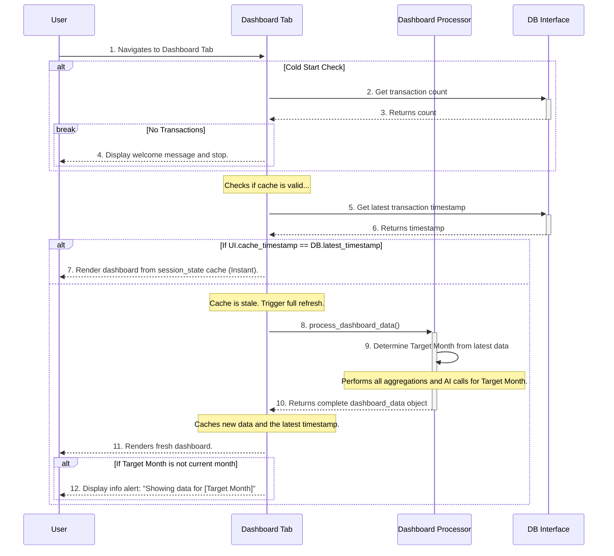

# Frontend Micro-Architecture: Dashboard Tab

**Author:** AI Architect
**Date:** July 18, 2025
**Status:** Final
**Version:** 1.1

## 1. Component Overview

This document provides the detailed micro-architecture for the **Dashboard Tab**. This tab serves as the main landing page, offering the user an at-a-glance overview of their financial status, key spending trends, and AI-powered insights.

**Version 1.1 Update:** This version introduces the "Target Month" logic to intelligently display the most relevant data and a robust session-level caching strategy to improve performance and user experience.

This design adheres to the principles outlined in the main `frontend_micro_architecture.md` and `system_architecture.md` documents.

## 2. Responsibilities

-   **Handle the "cold start" or empty state** by displaying a welcoming message when no transaction data is present.
-   **Intelligently determine the month to display** based on the most recent available transaction data (the "Target Month").
-   **Conditionally display an alert** if the data being shown is not from the current calendar month.
-   Display high-level Key Performance Indicators (KPIs) for the Target Month.
-   Present a clear visualization of expenses by category for the Target Month.
-   Show a historical view of spending over the last few months.
-   Render a concise, AI-generated summary of spending patterns and actionable insights.
-   Provide a list of the most recent transactions for immediate context.
-   Ensure the dashboard is clean, easy to read, and loads efficiently.

## 3. State Management: Intelligent Session Caching

To ensure a fast user experience, the dashboard will employ an intelligent, session-level caching strategy. The goal is to run the expensive `Dashboard Processor` only when absolutely necessary.

-   `st.session_state.dashboard_data`: A dictionary or dataclass holding all the data required for rendering (KPIs, chart data, AI insights, and display month info). This is the primary data cache.
-   `st.session_state.last_transaction_timestamp`: The timestamp of the most recent transaction that was used to generate the data in the cache. This is the key to the cache invalidation logic.

## 4. Component Logic and Sequence

This sequence outlines the complete data loading and rendering logic, incorporating the cold start, target month, and cache invalidation checks.

## 5. Feature Breakdown

### 5.1. Key Performance Indicators (KPIs)
-   **Description:** A row of 3-4 prominent, non-interactive stats for the Target Month.
-   **Required Data:** `total_spend`, `top_category`, `largest_transaction`.
-   **Implementation:** Use `st.metric` for a clean, clear display.

### 5.2. Expense by Category Chart
-   **Description:** A donut or pie chart showing the proportional split of spending across parent categories for the Target Month.
-   **Required Data:** A DataFrame with `category` and `amount` columns, pre-aggregated by the `Dashboard Processor`.
-   **Implementation:** Use `st.plotly_chart` or a similar library.

### 5.3. Spending Over Time Chart
-   **Description:** A bar chart showing total monthly spending for the last 6 months.
-   **Required Data:** A DataFrame with `month` and `total_amount` columns, pre-aggregated by the `Dashboard Processor`.
-   **Implementation:** Use `st.bar_chart`.

### 5.4. AI-Powered Insights
-   **Description:** A small, text-based section to display the AI-generated overview and insights.
-   **Required Data:** A JSON object or dictionary with `overview` and `insights` keys, as returned by the `Dashboard Processor`.
-   **Implementation:** Use `st.info` for the overview and `st.markdown` for the bulleted list of insights.

### 5.5. Recent Transactions
-   **Description:** A simple, scrollable table showing the 5-10 most recent transactions.
-   **Required Data:** A DataFrame slice of the most recent transactions.
-   **Implementation:** Use `st.dataframe`.

## 6. AI Integration: The Hybrid Prompt Model

To ensure the AI provides both accurate summaries and novel insights, the `Dashboard Processor` will use the **Hybrid Prompt** strategy:

1.  **Aggregate First:** The processor will compute a small, factual `financial_summary` JSON object containing all the key metrics (KPIs, category totals, etc.).
2.  **Slice Raw Data:** The processor will take a slice of the last 90 days of transactions, with a hard limit of **500 rows**, to provide context for pattern discovery.
3.  **Construct Two-Part Prompt:** It will send a single prompt to the LLM containing both the summary and the raw data slice, instructing the LLM to use the summary for the overview and the raw data for finding 1-2 novel insights.

This approach prevents sending excessive data to the LLM, ensuring performance and scalability, while still giving it enough context to generate valuable, non-obvious insights.

## 7. Error Handling

-   If the `Dashboard Processor` fails, the UI should display a user-friendly error message (e.g., "Could not load dashboard data. Please try again later.").
-   If the AI Backend call specifically fails, the `Dashboard Processor` should gracefully handle it by returning the rest of the dashboard data with an empty `insights` section. The UI should then render the dashboard without the AI component, ensuring the user can still see their core financial data.