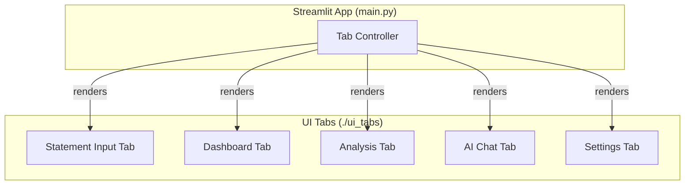

# Frontend High-Level Architecture

**Author:** AI Architect
**Date:** July 10, 2025

## 1. Overview

This document defines the high-level architecture and core principles for the Streamlit-based frontend of the Personal Expense Tracker. It serves as a parent document for the detailed micro-architecture of each individual UI tab.

## 2. High-Level Structure

The application will be organized into a series of tabs, each managed by its own dedicated Python module. This approach ensures a clean separation of concerns.

## 3. Core Frontend Principles

These principles must be maintained across all UI tab implementations to ensure consistency, reliability, and maintainability.

-   **State Management:** All UI state **must** be explicitly managed using Streamlit's `st.session_state`. This is critical for preserving user inputs and the state of multi-step workflows (like file uploads or chat history) across UI reruns.

-   **Component Responsibility:** Each UI tab is a self-contained component, encapsulated in its own module. It is responsible for its own layout, user interaction logic, and calls to the backend. A tab should not directly call or modify the state of another tab.

-   **Backend Decoupling:** The frontend components **must** interact with the backend through the defined public functions of the backend modules (e.g., `parse_pdf`, `OllamaConfigManager`, `DataProcessor`).

-   **UI-Layer Data Conversion:** The UI layer is responsible for converting framework-specific objects (like Streamlit's `UploadedFile`) into standard Python types (`io.BytesIO`) before passing them to any backend component. This ensures the core backend logic remains decoupled from the web framework.

-   **Error Handling:** All calls to the backend from the UI **must** be wrapped in `try...except` blocks. User-facing errors should be caught and displayed gracefully using `st.error()`.

-   **UI Consistency and Reusability:** To ensure a cohesive user experience, common UI elements (e.g., custom data display widgets, standardized error message boxes, specific button styles) should be built as reusable functions or components. This prevents code duplication and ensures a consistent look and feel across all tabs.

## 4. Detailed Micro-Architectures

For detailed design, state management, and sequence diagrams for each tab, please refer to the following documents:

-   **[Statement Input Tab Architecture](./statement_input_tab_arch.md)**
-   **[Settings Tab Architecture](./settings_tab_arch.md)**
-   *(Other tab architecture documents will be added here as they are created.)*
