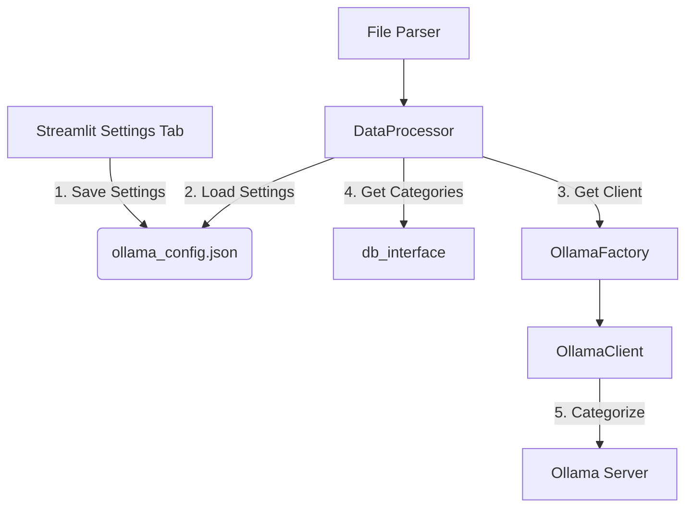

# Ollama Integration Strategy for Data Processor

**Author:** AI Architect
**Date:** July 10, 2025

## 1. High-Level Integration Strategy

This document outlines the architectural plan for integrating the `ai.ollama` module with the `DataProcessor` to enable AI-powered transaction categorization.

The core strategy is to make the `DataProcessor` responsible for orchestrating the AI categorization. When the processor receives a DataFrame of new transactions, it will use the `ai.ollama` module to contact the Ollama service, get a category prediction for each transaction, and enrich the DataFrame before it's saved to the database.

AI-powered categorization is a core feature of the application and is always active. The user can configure the connection parameters (e.g., server URL, model name) in the Streamlit settings.

## 2. Detailed Architectural Integration Plan

This is a step-by-step plan for the developer.

### 2.1. System-Level Configuration in Streamlit

This aligns with the `Settings Tab` responsibilities in `system_architecture.md`.

-   **Frontend (`Settings Tab`):** The UI must provide controls to configure the Ollama connection parameters.
    -   Text inputs for `Ollama Server URL`, `Model Name`, and `Timeout`.
-   **Backend Logic:** On save, the application must use the `OllamaConfigManager` from the `ai.ollama` module to write these values to the `ollama_config.json` file. This directly links the UI settings to the backend client's configuration.

### 2.2. Integrating the Ollama Client into the Data Processor

The `DataProcessor` must be able to communicate with the Ollama module.

-   **Dependency:** The `DataProcessor` class (`core/processors/data_processor.py`) must import the factory from the `ai.ollama` module.
    ```python
    # In core/processors/data_processor.py
    from ai.ollama.factory import get_ollama_client
    ```
-   **Initialization:** In its `__init__` method, the `DataProcessor` should always initialize the Ollama client.
    ```python
    # In DataProcessor.__init__
    self.ollama_client = get_ollama_client()
    ```

### 2.3. Modifying the Data Processing Pipeline

The `process_transactions` (or equivalent) method inside the `DataProcessor` requires a new step, as outlined in the micro-architecture.

**New Pipeline:**
`Validation -> Standardization -> Business Rules -> Duplicate Detection -> **AI Categorization**`

**AI Categorization Step Logic:**

1.  **Get Categories:** It must call the `db_interface` to get a `list` of all current category names. This is essential context for the AI prompt.
2.  **Iterate and Predict:** It should iterate through the rows of the transaction DataFrame. For each row where the `category` is missing or needs to be overwritten:
    -   Take the `transaction_description`.
    -   Call the Ollama client: `predicted_category = self.ollama_client.categorize_transaction(description, available_categories)`. The client should handle connection errors gracefully (e.g., by returning a default category), ensuring the pipeline doesn't crash if the Ollama server is unavailable.
    -   Update the `category` column in the DataFrame with the `predicted_category`.
3.  **Return DataFrame:** After the loop, it returns the enriched DataFrame, which is then passed to the `db_interface` for persistence.

### 2.4. Updated Data Flow Diagram

This diagram clarifies the new interactions for the developer:



## 3. Summary for the Developer

1.  **Implement the UI** in the Streamlit `Settings` tab to manage the Ollama connection parameters in `ollama_config.json`.
2.  **Update `DataProcessor`** to always initialize the `OllamaClient` via the `OllamaFactory` in its constructor.
3.  **Add a new step** to the `DataProcessor`'s pipeline that, for each transaction, gets the available categories from `db_interface` and calls `ollama_client.categorize_transaction`.
4.  **Ensure the enriched DataFrame** (with AI-predicted categories) is what gets passed to `db_interface` for saving.

This approach maintains a clean separation of concerns: Streamlit handles user-facing configuration, the `DataProcessor` orchestrates business logic, and the `ai.ollama` module manages external communication.
