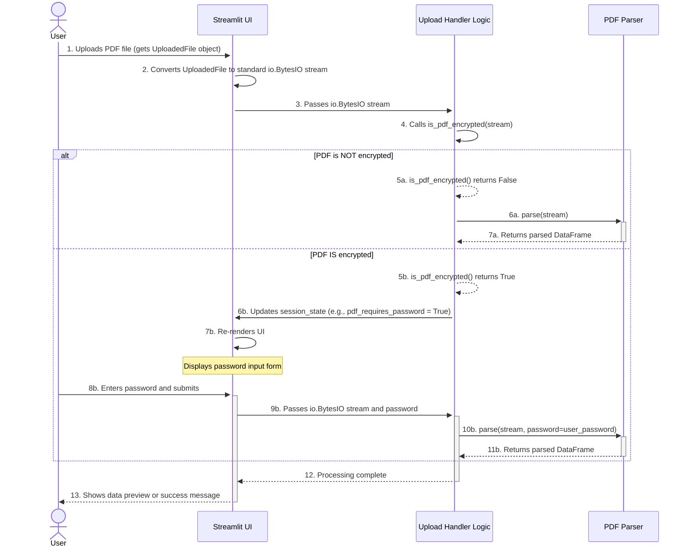

# PDF Upload and Password Handling Sequence

**Author:** AI Architect
**Date:** July 10, 2025

## 1. Objective

This document defines the standard user interaction sequence for uploading PDF files in the Streamlit frontend. The primary goal is to create a smooth user experience that gracefully handles both standard (password-less) and encrypted (password-protected) PDF files.

This flow correctly decouples the Streamlit framework from the core parsing logic by ensuring the UI layer is responsible for converting framework-specific file objects into standard `io.BytesIO` streams before passing them to the backend.

## 2. User Interaction Flow

The flow is designed to check for encryption first and only prompt the user for a password if it is absolutely necessary.

## 3. Detailed Scenarios

### Scenario 1: Password-less PDF

1.  **Upload:** The user uploads a PDF file using `st.file_uploader`.
2.  **Conversion:** The Streamlit UI handler immediately reads the content of the `UploadedFile` object and creates a standard, in-memory `io.BytesIO` stream.
3.  **Initial Check:** The backend handler receives the `io.BytesIO` stream and calls `is_pdf_encrypted()` to check its status.
4.  **Detection:** The check returns `False`.
5.  **Processing:** The backend immediately proceeds to the main parsing logic, passing the `io.BytesIO` stream to the `PDFParser`.

### Scenario 2: Password-Protected PDF

1.  **Upload & Conversion:** The user uploads an encrypted PDF. The UI handler converts it to an `io.BytesIO` stream.
2.  **Initial Check:** The backend handler calls `is_pdf_encrypted()` on the stream.
3.  **Detection:** The check returns `True`.
4.  **Request Password:** The backend sets a flag in Streamlit's session state (e.g., `st.session_state['pdf_requires_password'] = True`).
5.  **Display Form:** The Streamlit UI re-renders, displaying a password input form.
6.  **Submit Password:** The user enters the password and submits.
7.  **Final Processing:** The backend handler now has both the `io.BytesIO` stream and the password. It passes both to the `PDFParser` to complete the parsing.

## 4. Architectural Implications for the PDF Parser

This user flow dictates the following requirements for the `PDFParser`'s design:

1.  **Accepts Standard Types:** The parser must accept a file path (`str`) or a standard binary stream (`io.BytesIO`), but **not** a Streamlit-specific object. This ensures the core logic is decoupled from the web framework.
2.  **Accepts Optional Password:** The main `parse` method must accept an optional `password` argument.
3.  **Separate Encryption Check:** A separate, lightweight function (`is_pdf_encrypted`) must exist to quickly and efficiently check for encryption.
