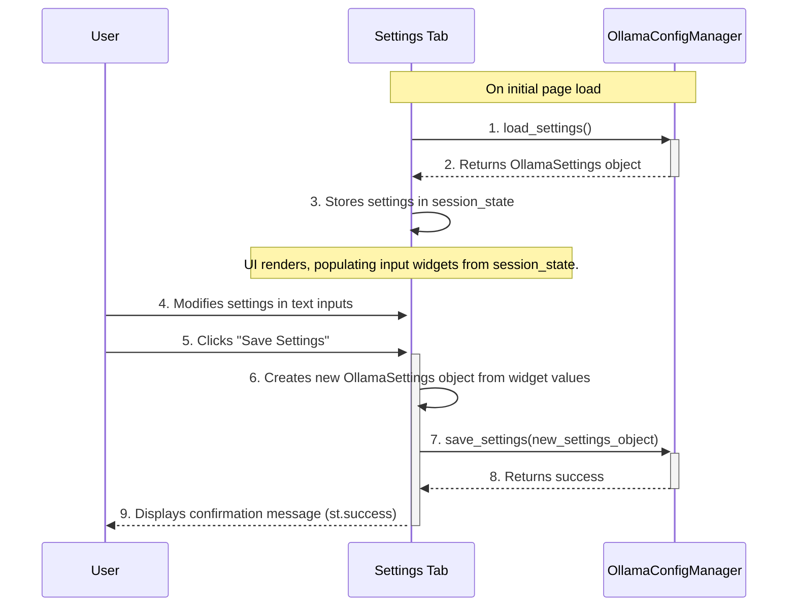

# Frontend Micro-Architecture: Settings Tab

**Author:** AI Architect
**Date:** July 10, 2025

## 1. Component Overview

This document provides the detailed micro-architecture for the **Settings Tab**. This tab serves as the application's configuration center, allowing the user to manage backend services and other preferences. The initial focus is on configuring the Ollama AI integration.

This design adheres to the principles outlined in the main `frontend_micro_architecture.md` document.

## 2. Responsibilities

-   Load the current Ollama settings from the configuration source when the tab is first displayed.
-   Provide text input widgets for the user to view and edit the Ollama server URL, model name, and request timeout.
-   Save the updated settings to the `ollama_config.json` file via the configuration manager.
-   Display a confirmation message to the user upon successfully saving the settings.

## 3. State Management (`st.session_state`)

-   `st.session_state.ollama_settings`: An `OllamaSettings` dataclass object holding the current configuration values. This is used to populate the input widgets and ensure the state persists across reruns.

## 4. Component Logic and Sequence

This sequence details the workflow for loading and saving settings, ensuring a clear separation between the UI and the backend configuration logic.

## 5. Error Handling

-   The UI **must** wrap the call to `save_settings` in a `try...except` block.
-   If an exception occurs (e.g., due to file permission errors when writing the `ollama_config.json` file), the error will be caught and displayed to the user via `st.error()`.
