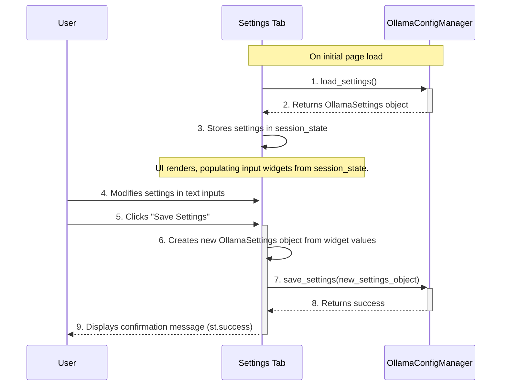
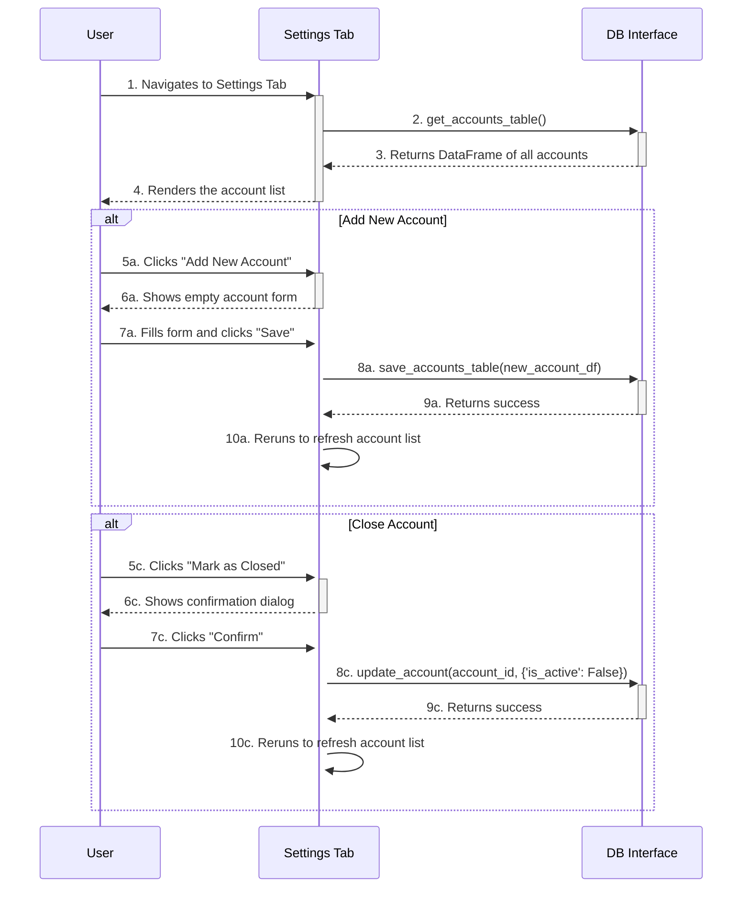

# Frontend Micro-Architecture: Settings Tab

**Author:** AI Architect
**Date:** July 24, 2025
**Version:** 2.0

## 1. Component Overview

This document provides the detailed micro-architecture for the **Settings Tab**. This tab serves as the application's configuration center.

**Version 2.0 Update:** This version introduces the **Account Management** feature, allowing users to create, edit, and close their financial accounts. This is in addition to the existing **Ollama Configuration** functionality.

This design adheres to the principles outlined in the main `frontend_micro_architecture.md` document.

## 2. Responsibilities

### Ollama Configuration
-   Load the current Ollama settings from the configuration source.
-   Provide text input widgets for the user to view and edit the Ollama server URL, model name, and request timeout.
-   Save the updated settings to the `ollama_config.json` file.

### Account Management
-   Provide a clear interface for viewing all user-created accounts.
-   Allow a user to create a new financial account at any time.
-   Allow a user to edit the details of an existing account.
-   Provide a safe mechanism for a user to close an account without losing historical data (soft deletion).

## 3. State Management (`st.session_state`)

-   `st.session_state.ollama_settings`: An `OllamaSettings` dataclass object holding the current configuration values.
-   `st.session_state.show_account_modal`: A boolean flag to control the visibility of the Add/Edit Account modal dialog.
-   `st.session_state.editing_account_id`: Stores the ID of the account being edited to pre-populate the form.

## 4. Component Logic and Sequence

This sequence details the workflow for loading and saving settings, ensuring a clear separation between the UI and the backend configuration logic.

```mermaid
sequenceDiagram
    participant User
    participant UI as Settings Tab
    participant ConfigManager as OllamaConfigManager

    Note over UI, ConfigManager: On initial page load
    UI->>+ConfigManager: 1. load_settings()
    ConfigManager-->>-UI: 2. Returns OllamaSettings object
    UI->>UI: 3. Stores settings in session_state
    Note over UI: UI renders, populating input widgets from session_state.

    User->>+UI: 4. Modifies settings in text inputs
    User->>+UI: 5. Clicks "Save Settings"

    UI->>UI: 6. Creates new OllamaSettings object from widget values
    UI->>+ConfigManager: 7. save_settings(new_settings_object)
    ConfigManager-->>-UI: 8. Returns success

    UI-->>-User: 9. Displays confirmation message (st.success)
```

## 5. Error Handling

-   The UI **must** wrap calls to save settings or account data in a `try...except` block.
-   If an exception occurs (e.g., due to file permission errors or database constraints), the error will be caught and displayed to the user via `st.error()`.

## 6. Feature: Account Management

This section details the UI and logic for the manual account management feature.

### 6.1. Main View

-   **Layout:** A table displaying all existing accounts, fetched via `db_interface.get_accounts_table()`. The table will show `name`, `account_type`, `bank_name`, and `status` (`Active` or `Closed`).
-   **Actions:** Each row will have an "Edit" button and a "Mark as Closed" button (disabled for closed accounts). An "Add New Account" button will be placed above the list.

### 6.2. "Add/Edit Account" Workflow

-   **UI:** A modal dialog (`st.dialog`) triggered by the action buttons.
-   **Form Fields:** `Account Name`, `Account Type`, `Bank Name`, `Account Number (Last 4)`.
-   **Action:** On submission, the UI calls the appropriate `db_interface` method (`save_accounts_table` or `update_account`).

### 6.3. "Close Account" Workflow

-   **UI:** A confirmation dialog (`st.dialog`) to prevent accidental closure.
-   **Action:** On confirmation, the UI calls `db_interface.update_account()` with `is_active=False`.

### 6.4. Component Interaction Sequence

```mermaid
sequenceDiagram
    participant User
    participant UI as Settings Tab
    participant DB as DB Interface

    User->>+UI: 1. Navigates to Settings Tab
    UI->>+DB: 2. get_accounts_table()
    DB-->>-UI: 3. Returns DataFrame of all accounts
    UI-->>-User: 4. Renders the account list

    alt Add New Account
        User->>+UI: 5a. Clicks "Add New Account"
        UI-->>-User: 6a. Shows empty account form
        User->>+UI: 7a. Fills form and clicks "Save"
        UI->>+DB: 8a. save_accounts_table(new_account_df)
        DB-->>-UI: 9a. Returns success
        UI->>UI: 10a. Reruns to refresh account list
    end

    alt Close Account
        User->>+UI: 5c. Clicks "Mark as Closed"
        UI-->>-User: 6c. Shows confirmation dialog
        User->>+UI: 7c. Clicks "Confirm"
        UI->>+DB: 8c. update_account(account_id, {'is_active': False})
        DB-->>-UI: 9c. Returns success
        UI->>UI: 10c. Reruns to refresh account list
    end
```
