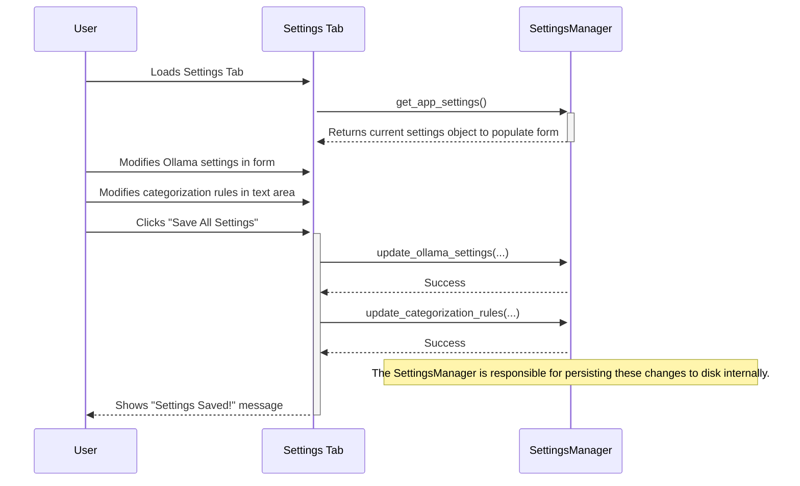

# Settings Tab Architecture

**Component:** `frontend.tabs.settings_tab`  
**Last Updated:** July 31, 2025  
**Status:** FINALIZED

---

## 1. **What & Why**

**Purpose:** This component provides the user interface for managing all global application settings, including AI configurations and custom categorization rules.

**Key Decisions:**
- **Centralized Form (`st.form`)**: All settings are managed within a single form to ensure changes are saved atomically with one user action.
- **Direct `SettingsManager` Interaction**: The UI interacts exclusively with the `SettingsManager` singleton, which is the single source of truth for all configuration, avoiding the use of `st.session_state` for settings data.

---

## 2. **Where It Fits**

```
┌───────────────┐      ┌──────────────┐      ┌─────────────────┐
│     User      │----▶ │ Settings Tab │----▶ │ SettingsManager │
│ (via browser) │      │     (UI)     │      │    (Backend)    │
└───────────────┘      └──────────────┘      └─────────────────┘
```

**Depends On:**
- **Streamlit:** For all UI rendering.
- **`core.config.settings_manager`:** To read the current settings and to save updated settings.

**Used By:**
- **`frontend.app`:** The main application shell renders this component as one of the primary tabs.

---

## 3. **Core API**

The Settings Tab exposes a single public function to the main application shell.

```python
def render() -> None:
    """
    Renders the entire Settings Tab UI, including the settings form,
    expandable sections for different setting groups, and the save button.
    Handles the logic for loading data from and saving data to the SettingsManager.
    """
    pass
```

---

## 4. **Data Flow Diagram**

This diagram shows the interaction between the user, the UI, and the backend `SettingsManager` when loading and saving settings.


```mermaid
sequenceDiagram
    participant User
    participant UI as Settings Tab
    participant SM as SettingsManager

    User->>+UI: Loads Settings Tab
    UI->>+SM: get_app_settings()
    SM-->>-UI: Returns current settings object to populate form

    User->>UI: Modifies Ollama settings in form
    User->>UI: Modifies categorization rules in text area
    User->>+UI: Clicks "Save All Settings"

    UI->>+SM: update_ollama_settings(...)
    SM-->>UI: Success

    UI->>+SM: update_categorization_rules(...)
    SM-->>UI: Success

    Note over SM: The SettingsManager is responsible for persisting these changes to disk internally.

    UI-->>-User: Shows "Settings Saved!" message
```
