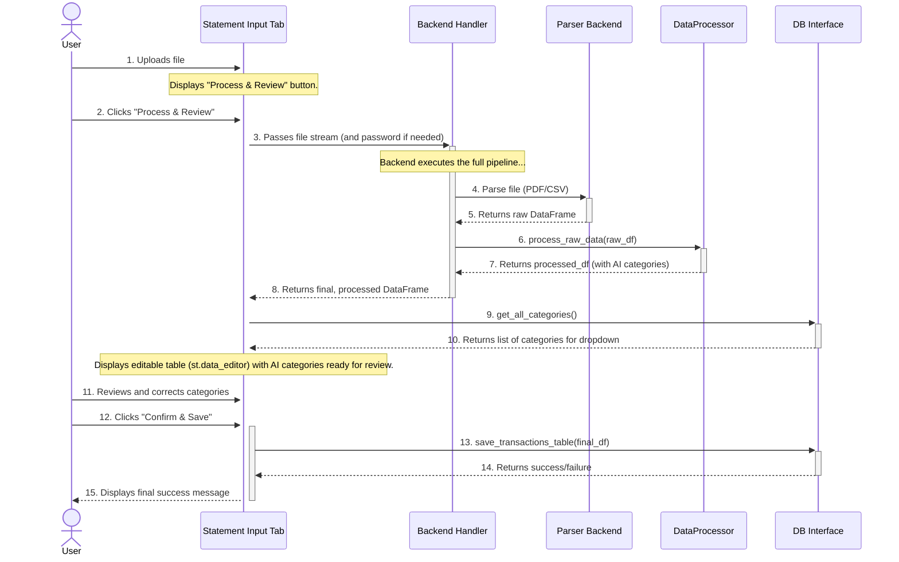

# Frontend Micro-Architecture: Statement Input Tab

**Author:** AI Architect
**Date:** July 10, 2025

## 1. Component Overview

This document provides the detailed micro-architecture for the **Statement Input Tab**. This tab is the primary user entry point for uploading and processing new transaction files (PDFs, CSVs, etc.).

This design adheres to the principles outlined in the main `frontend_micro_architecture.md` document. It follows a streamlined, two-step user workflow: **Process & Review -> Save**.

## 2. Responsibilities

-   Provide a file uploader widget for supported file types.
-   Orchestrate the password-handling flow for encrypted PDFs behind the scenes.
-   Provide a single action button (e.g., "Process & Review") to trigger the entire backend data pipeline (parsing and processing).
-   Display a final, editable preview of the fully processed and categorized data. The user should not be shown raw, intermediate data.
-   Allow users to review and correct AI-assigned categories directly in the preview table.
-   Provide a mechanism to save the final, user-verified data to the database.
-   Show clear success, error, and progress messages to the user.

## 3. State Management (`st.session_state`)

-   `st.session_state.processed_df`: A pandas DataFrame holding the fully standardized and categorized data, ready for user review and editing. This is the primary data state for this tab.
-   `st.session_state.upload_error`: A string to hold any error message from the entire backend pipeline (parsing or processing), to be displayed with `st.error()`.

## 4. Component Logic and Sequence

This sequence details the streamlined **Process & Review -> Save** workflow. It combines parsing and processing into a single user action to provide a better user experience. The user is only shown the final, clean data.

## 5. Error Handling

-   The UI **must** wrap the entire backend pipeline call (parsing and processing) in a single `try...except ValueError` block.
-   Any `ValueError` raised from either the `Parser` or the `DataProcessor` will be caught and its message will be stored in `st.session_state.upload_error` and displayed to the user using `st.error()`. This provides a single, clean point for error feedback.
