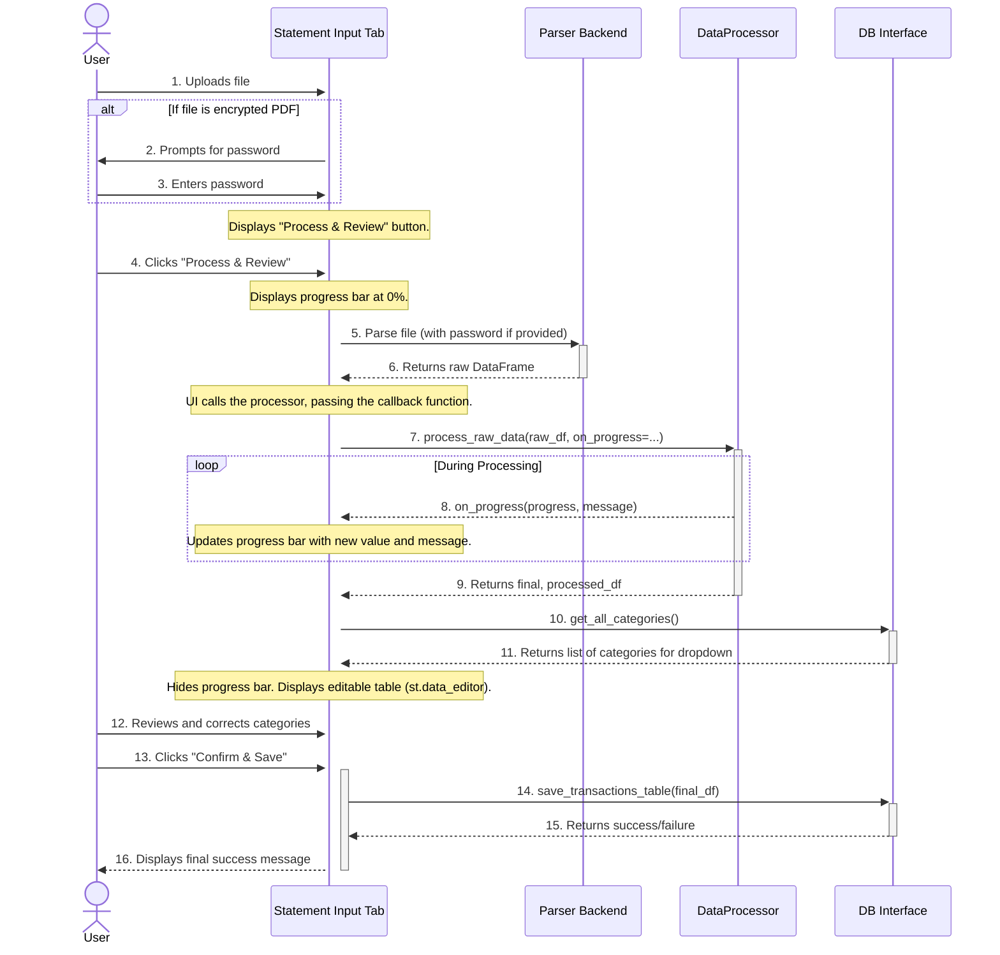

# Frontend Micro-Architecture: Statement Input Tab

**Author:** AI Architect
**Date:** July 18, 2025
**Version:** 2.3

## 1. Component Overview

This document provides the detailed micro-architecture for the **Statement Input Tab**. This tab is the primary user entry point for uploading and processing new transaction files (PDFs, CSVs, etc.).

This design adheres to the principles outlined in the main `frontend_micro_architecture.md` document and reflects the current implementation. It follows a streamlined, two-step user workflow: **Process & Review -> Save**.

**Version 2.3 Update:** The sequence diagram has been refined to more accurately represent the architectural interactions, removing internal implementation details for clarity.

## 2. Responsibilities

-   Provide a file uploader widget for supported file types.
-   **Detect encrypted PDFs and prompt the user for a password.**
-   Provide a single action button ("Process & Review") to trigger the entire backend data pipeline.
-   **Display a real-time progress bar** during data processing.
-   Display a final, editable preview of the fully processed and categorized data.
-   Allow users to review and correct AI-assigned categories in the preview table.
-   Provide a mechanism to save the final, user-verified data to the database.
-   Show clear success, error, and progress messages to the user.

## 3. State Management (`st.session_state`)

-   `st.session_state.processed_df`: A pandas DataFrame holding the fully standardized and categorized data, ready for user review and editing. This is the primary data state for this tab.
-   `st.session_state.upload_error`: A string to hold any error message from the backend pipeline, to be displayed with `st.error()`.

## 4. Component Logic and Sequence (with Password Flow and Progress Callback)

This sequence accurately reflects the **existing implementation** in `frontend/tabs/statement_input_tab.py`. The diagram focuses on the key interactions between components.



### **UI Implementation Details**

The frontend implementation is straightforward:

1.  **Instantiate UI Elements:** Before calling the processor, create the progress bar element:
    ```python
    progress_bar = st.progress(0.0, text="Starting processing...")
    ```

2.  **Define the Callback:** Create a simple function that matches the required `(float, str)` signature and whose only job is to update the UI element.
    ```python
    def update_progress_in_ui(progress_value, message_text):
        progress_bar.progress(progress_value, text=message_text)
    ```

3.  **Invoke the Processor:** Pass the defined function as the `on_progress` argument.
    ```python
    final_df = data_processor.process_raw_data(
        raw_df, 
        on_progress=update_progress_in_ui
    )
    ```

This design correctly decouples the UI from the backend. The `DataProcessor` knows nothing about `st.progress`; it only knows that it has an optional function to call. The UI is responsible for providing a function that knows how to update its own state.

## 5. Error Handling

-   The UI **must** wrap the entire backend pipeline call (parsing and processing) in a single `try...except ValueError` block.
-   Any `ValueError` raised from either the `Parser` or the `DataProcessor` will be caught and its message will be stored in `st.session_state.upload_error` and displayed to the user using `st.error()`. This provides a single, clean point for error feedback.
-   The progress bar should be updated to 100% and hidden or removed upon successful completion or when an error occurs to avoid a stalled UI element.