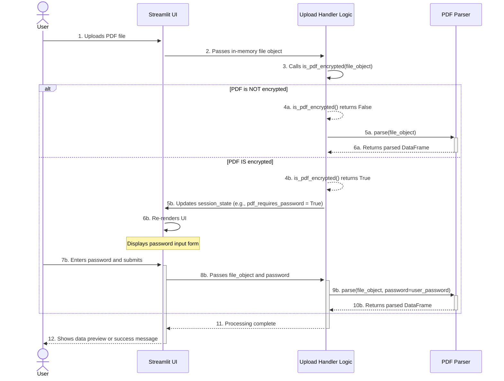

# PDF Upload and Password Handling Sequence

**Author:** AI Architect
**Date:** July 10, 2025

## 1. Objective

This document defines the standard user interaction sequence for uploading PDF files in the Streamlit frontend. The primary goal is to create a smooth user experience that gracefully handles both standard (password-less) and encrypted (password-protected) PDF files. This sequence should be followed by the frontend developer to ensure consistency with the backend parser's architecture.

## 2. User Interaction Flow

The flow is designed to check for encryption first and only prompt the user for a password if it is absolutely necessary.

## 3. Detailed Scenarios

### Scenario 1: Password-less PDF

1.  **Upload:** The user uploads a PDF file using `st.file_uploader`.
2.  **Initial Check:** The backend handler receives the in-memory file object and calls a lightweight function, `is_pdf_encrypted()`, to check its status.
3.  **Detection:** The check returns `False`.
4.  **Processing:** The backend immediately proceeds to the main parsing logic, passing the file object to the `PDFParser`. The user sees a standard "Processing..." indicator.

### Scenario 2: Password-Protected PDF

1.  **Upload:** The user uploads an encrypted PDF file.
2.  **Initial Check:** The backend handler calls `is_pdf_encrypted()`.
3.  **Detection:** The check attempts to open the file, catches a password-related error from the underlying PDF library, and returns `True`.
4.  **Request Password:** The backend sets a flag in Streamlit's session state (e.g., `st.session_state['pdf_requires_password'] = True`).
5.  **Display Form:** The Streamlit UI automatically re-runs. Because the session state flag is `True`, a password input form (`st.text_input(type="password")`) is rendered.
6.  **Submit Password:** The user enters the password and clicks a "Submit" button.
7.  **Final Processing:** The backend handler now has both the file object and the password. It passes both to the `PDFParser` to complete the parsing.

## 4. Architectural Implications for the PDF Parser

This user flow dictates the following requirements for the `PDFParser`'s design:

1.  **Accepts In-Memory Objects:** The parser must be able to read from an in-memory file object (e.g., `io.BytesIO`), not just a file path.
2.  **Accepts Optional Password:** The main `parse` method must accept an optional `password` argument.
3.  **Separate Encryption Check:** A separate, lightweight function (`is_pdf_encrypted`) must exist to quickly and efficiently check for encryption without performing a full parse.
