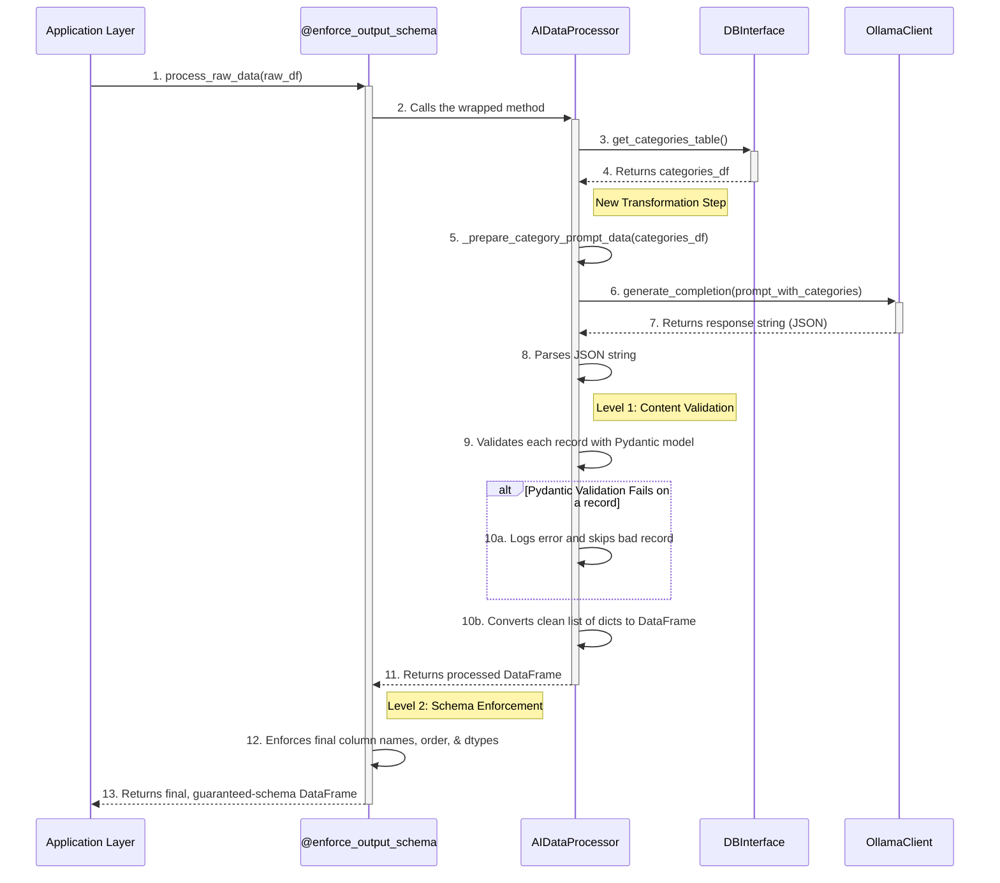

# AI-Powered Data Processor Micro-Architecture

**Author:** AI Architect
**Date:** July 10, 2025

## 1. Component Overview

This document defines the micro-architecture for the `AIDataProcessor`. This component serves as an advanced, AI-driven alternative to the standard `RuleBasedDataProcessor`. It leverages a Large Language Model (LLM) via the `OllamaClient` to perform both the structuring and categorization of raw transaction data in a single, intelligent step.

Its primary goal is to handle a wide variety of inconsistent and unpredictable bank statement formats without requiring hard-coded rules.

## 2. Architectural Pattern: Strategy & Decorator

This processor follows two key patterns:

1.  **Strategy Pattern:** It adheres to the `AbstractDataProcessor` interface, making it interchangeable with any other processor.
2.  **Decorator Pattern:** Its `process_raw_data` method is wrapped by the `@enforce_output_schema` decorator, which **guarantees** that its final output DataFrame conforms to the application-wide standard schema, regardless of its internal logic.

## 3. Position in System Architecture

The `AIDataProcessor` sits in the same position as the standard processor, taking its input from the parsers and producing a standardized DataFrame for the `DBInterface`.

```
┌─────────────────────────────────────────────────────────────────┐
│                    FILE PARSERS                                 │
└─────────────┬───────────────────────────────────────────────────┘
              │ Raw pandas DataFrame (any column names/structure)
┌─────────────▼───────────────────────────────────────────────────┐
│                  AI_DATA_PROCESSOR COMPONENT                    │
│  • Converts DataFrame to Text                                   │
│  • Engineers & Sends Prompt to LLM                              │
│  • Parses LLM's JSON Response                                   │
│  • **Validates Content via Pydantic**                           │
│  • Converts validated JSON to DataFrame                         │
└─────────────┬───────────────────────────────────────────────────┘
              │ Standardized DataFrame (guaranteed by decorator)
┌─────────────▼───────────────────────────────────────────────────┐
│                  DB_INTERFACE COMPONENT                         │
└─────────────────────────────────────────────────────────────────┘
```

## 4. Core Responsibilities

| Responsibility | Description |
|---|---|
| **Category Transformation** | **(New)** Transform the normalized `(name, parent_category)` DataFrame from the `DBInterface` into a hierarchical dictionary suitable for prompt engineering. |
| **Data Serialization** | Convert the input raw pandas DataFrame into a simple text format (e.g., CSV) for the LLM. |
| **Prompt Engineering** | Dynamically construct a detailed prompt containing the serialized data, instructions, and the transformed category/sub-category hierarchy. |
| **LLM Communication** | Use the `OllamaClient` to send the prompt to the LLM and receive the response. |
| **Content Validation** | **(Critical)** Use a Pydantic model to validate the content, structure, and data types of each individual record in the JSON response from the LLM. |
| **DataFrame Conversion** | Convert the list of validated Pydantic objects into a pandas DataFrame. |

## 5. Component Logic and Sequence

The sequence is updated to include the new category transformation step.



### **Category Data Transformation (`_prepare_category_prompt_data`)**

This new private helper method is critical for creating an effective prompt.

-   **Input**: A pandas DataFrame from `db_interface.get_categories_table()` with columns `['name', 'parent_category']`.
-   **Logic**:
    1.  Initialize an empty dictionary, `hierarchy = {}`.
    2.  Iterate through the DataFrame to identify all unique parent categories and initialize them as keys with empty lists (e.g., `{'Food': [], 'Travel': []}`).
    3.  Iterate through the DataFrame again. For each row with a `parent_category`, append its `name` to the corresponding list in the dictionary.
-   **Output**: A dictionary structured for the LLM, like:
    ```json
    {
      "Food": ["Groceries", "Restaurant"],
      "Utilities": [],
      "Travel": ["Flights", "Hotels"]
    }
    ```

## 6. Two-Level Validation Details

### Level 1: Content Validation (Pydantic Model)

The `AIDataProcessor` **must** use a Pydantic model to validate the content of each record returned by the LLM. This ensures data integrity.

```python
# To be defined in core/processors/schema.py
from pydantic import BaseModel
from datetime import date

class StandardTransaction(BaseModel):
    description: str
    transaction_date: date
    amount: float
    category: str = "Other"
    sub_category: str = ""
```

### Level 2: Schema Enforcement (Decorator)

The `@enforce_output_schema` decorator provides a final, lightweight guarantee. It trusts that the processor has cleaned the data, and it simply enforces the final DataFrame structure (column names, order, dtypes) to ensure it matches the `DBInterface` contract.

## 7. Interface and Output Contract

The `AIDataProcessor` implements the `AbstractDataProcessor` interface. The combination of internal Pydantic validation and the external decorator guarantees the output.

-   **Processor's Responsibility:** To produce a DataFrame with clean, valid data in each row.
-   **Decorator's Responsibility:** To guarantee the final output DataFrame has the exact columns, order, and data types expected by the `DBInterface`.

Refer to the official contract for the exact schema:
[Processor Output Schema Contract](./processor_output_schema.md)

## 8. Error Handling

-   **LLM/JSON Failure:** If the `OllamaClient` fails or returns invalid JSON, the processor will raise a `ValueError`.
-   **Pydantic Validation Failure:** If an individual record from the LLM fails content validation, it will be logged and skipped by the processor.
-   **Schema Enforcement Failure:** If the processor returns a DataFrame that the decorator cannot conform to the standard schema, the decorator will raise a `SchemaValidationError`.
