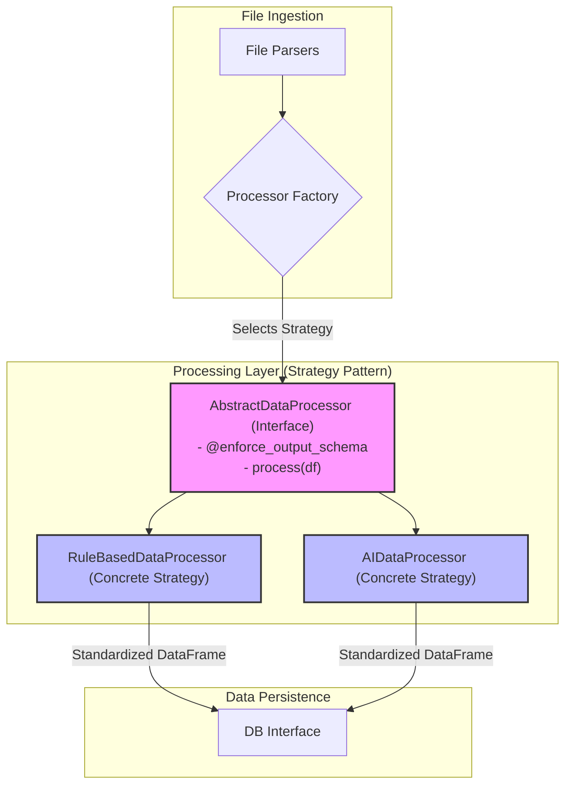

# Data Processor Architectural Strategy

## **1. Overview: The Strategy Pattern**

To provide maximum flexibility and enable user-selectable processing logic, the data processor layer is built upon the **Strategy design pattern**. This pattern allows the core data transformation algorithm to be selected at runtime. The primary goal is to support distinct processing methods—a deterministic **Rule-Based Processor** and an intelligent **AI-Powered Processor**—while ensuring they both produce a standardized, reliable output for the downstream `db_interface`.

This is achieved through a common `AbstractDataProcessor` interface, which every concrete processor must implement. A schema-enforcing decorator is applied to the interface's core method to guarantee output consistency, regardless of the chosen strategy.

## **2. Architectural Components**



| Component | Description |
|---|---|
| **Processor Factory** | A factory responsible for instantiating the correct processor (`RuleBased` or `AI`) based on user settings or system configuration. |
| **AbstractDataProcessor** | An abstract base class that defines the common interface (`process` method) for all data processors. It enforces the output schema via a decorator. |
| **RuleBasedDataProcessor** | A concrete implementation that uses deterministic rules for column mapping, cleaning, and categorization. |
| **AIDataProcessor** | A concrete implementation that leverages an external LLM to interpret, categorize, and structure the transaction data. |

## **3. Core Contract: Interface and Decorator**

The entire pattern is built upon a strict contract that guarantees a predictable output schema for the `db_interface`.

### **`AbstractDataProcessor` Interface**

This is the foundational contract for any processing strategy.

```python
from abc import ABC, abstractmethod
import pandas as pd

class AbstractDataProcessor(ABC):
    """
    Abstract interface for a data processing strategy.
    Ensures that any implementation can be used interchangeably.
    """

    @abstractmethod
    @enforce_output_schema
    def process(self, raw_df: pd.DataFrame) -> pd.DataFrame:
        """
        Processes a raw DataFrame and returns a standardized DataFrame.
        The @enforce_output_schema decorator guarantees the output format.
        """
        pass
```

### **`@enforce_output_schema` Decorator**

This decorator is the key to ensuring system stability. It is applied to the `process` method in the abstract class. After any concrete processor (Rule-Based or AI) finishes its work, this decorator inspects the resulting DataFrame and performs the final transformation to match the exact database schema requirements.

**Responsibilities:**
- **Column Selection**: Selects only the required columns (`description`, `transaction_date`, `amount`, `category`, `sub_category`).
- **Column Renaming**: Ensures column names are exactly as specified.
- **Data Type Coercion**: Forces each column to its required `dtype` (e.g., `amount` to `float`, `transaction_date` to `datetime64[ns]`).
- **Order Enforcement**: Arranges columns in the standard, expected order.
- **Error Handling**: Raises an error if a required column cannot be created or a data type conversion fails.

---

# **Concrete Strategy: `RuleBasedDataProcessor`**

This document section details the implementation of the `RuleBasedDataProcessor`, which uses deterministic logic to transform data, reflecting the functionality in `core/processors/data_processor.py`.

## **Component Overview**

The `RuleBasedDataProcessor` serves as the **default Data Transformation and Validation Engine**. It converts raw parsed bank statement data into standardized pandas DataFrames using a pipeline of explicit rules for column mapping, data validation, cleaning, and basic categorization.

## **Core Responsibilities**

| Responsibility | Description | Input | Output |
|----------------|-------------|-------|--------|
| **Column Mapping** | Maps raw columns to a standard schema using keyword matching, including logic for debit/credit columns. | Raw DataFrame | Mapped DataFrame |
| **Data Validation & Cleaning** | Validates data types, handles multiple date formats, cleans currency symbols, and removes duplicates. | Mapped DataFrame | Validated DataFrame |
| **Rule-Based Categorization** | Assigns categories and sub-categories based on simple, explicit rules (keyword matching, amount thresholds). | Cleaned DataFrame | Categorized DataFrame |
| **Error Handling** | Raises errors for critical issues like missing required columns or data that cannot be cleaned. | Invalid data | Exception |

## **Data Flow Architecture**

The internal processing pipeline for the rule-based strategy follows these steps:

```
Raw Data Input → Column Mapping → Data Validation & Cleaning → Rule-Based Categorization → Output (to Decorator)
      ↓              ↓                   ↓                        ↓
   Any Format → Standard Columns →   Clean Data       → Categorized Data (pre-schema enforcement)
```

## **Component Architecture**

### **Class Structure**

```python
import pandas as pd

class RuleBasedDataProcessor(AbstractDataProcessor):
    """
    Rule-based data processing for personal expense tracking.
    Implements the AbstractDataProcessor interface.
    """
    
    # Main Processing Method (decorated in abstract class)
    def process(self, raw_df: pd.DataFrame) -> pd.DataFrame:
        """
        Executes the rule-based processing pipeline.
        """
        mapped_df = self._map_columns(raw_df)
        cleaned_df = self._validate_and_clean_data(mapped_df)
        categorized_df = self._add_rule_based_categories(cleaned_df)
        # The @enforce_output_schema decorator will run after this return
        return categorized_df
    
    # Internal Helper Methods
    def _map_columns(self, raw_df: pd.DataFrame) -> pd.DataFrame:
        # ... implementation ...
        pass

    def _validate_and_clean_data(self, df: pd.DataFrame) -> pd.DataFrame:
        # ... implementation ...
        pass
        
    def _add_rule_based_categories(self, df: pd.DataFrame) -> pd.DataFrame:
        # ... implementation ...
        pass
```

## **Detailed Implementation Logic**

### **Column Mapping (`_map_columns`)**
- **Keyword Matching**: Uses a predefined dictionary to map variations of column names (e.g., "trans_date", "posting_date") to the standard `transaction_date`.
- **Debit/Credit Combination**: If a single `amount` column is not found, it searches for `debit` and `credit` columns. If found, it combines them into a single `amount` column, where debit values are made negative.
- **Error Handling**: Raises a `ValueError` if required columns (`transaction_date`, `description`, `amount`) cannot be mapped.

### **Validation and Cleaning (`_validate_and_clean_data`)**
- **Date Parsing**: Handles multiple date formats by iterating through a list of common formats (`%Y-%m-%d`, `%d/%m/%Y`, etc.) and attempting to parse. Falls back to pandas' general `to_datetime` for auto-detection. Rows with unparseable dates are dropped.
- **Amount Cleaning**: If the amount column is text-based, it systematically removes common currency symbols (e.g., `Rs`, `, `€`, `₹`), thousands separators (`,`), and whitespace before converting to a numeric type. Rows with non-numeric amounts are dropped.
- **Description Cleaning**: Trims leading/trailing whitespace. Rows with empty descriptions are removed.
- **Duplicate Removal**: Drops duplicate rows based on the combination of `transaction_date`, `amount`, and `description`.

### **Categorization (`_add_rule_based_categories`)**
- **Category Assignment**: Uses a dictionary of categories and associated keywords (e.g., `'Food & Dining': ['restaurant', 'swiggy']`). It iterates through transaction descriptions and assigns the first matching category. If no keywords match, it assigns a default category like 'Other'.
- **Sub-Category Assignment**: Applies a simple rule based on the transaction amount. For example, amounts > 10000 are 'Large Transaction', amounts < 100 are 'Small Transaction'.

## **Integration Contracts**

### **Input Contract (from File Parsers)**
The input contract is the same for any processor.
```
Expected Input:
├─ raw_df: pd.DataFrame with any column structure
├─ source_metadata: Dict (file info, parsing details)
```

### **Output Contract (to db_interface)**
The output contract is **guaranteed by the `@enforce_output_schema` decorator** for ANY processor that implements the interface.

Refer to the official contract for the exact schema:
[Processor Output Schema Contract](./processor_output_schema.md)


---

**Document Version**: 2.1
**Last Updated**: 2025-07-15
**Component Phase**: Core Implementation
**Dependencies**: system_architecture.md, db_interface_micro_architecture.md
**Integration Points**: File Parsers → Processor Factory → `(RuleBased|AI)DataProcessor` → db_interface
