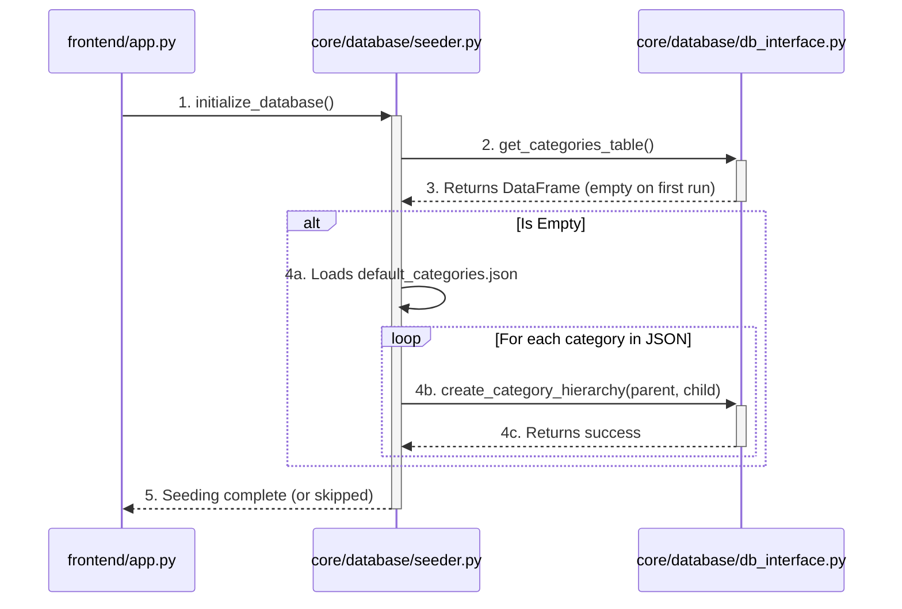

# Architectural Plan: Initial Category Seeding

**Date:** 2025-07-15
**Author:** AI Architect
**Status:** Proposed

---

## 1. Problem Statement

The `AIDataProcessor` relies on a predefined list of categories to effectively prompt the LLM for transaction categorization. In a new application deployment, the database is empty, meaning no categories exist. This "cold start" problem prevents the AI processor from functioning correctly, as it cannot provide the required category hierarchy to the LLM.

## 2. Objective

To solve the cold start problem by implementing an automatic, idempotent database "seeding" mechanism. This process will populate the database with a default, well-structured set of expense categories on the application's first run, ensuring the `AIDataProcessor` is always provided with a valid hierarchy.

## 3. Guiding Principles

-   **Non-Invasive:** The solution should not require modifications to existing, stable components like the data processors or the core database interface.
-   **Separation of Concerns:** The category data (configuration) should be separate from the seeding logic (code).
-   **Idempotent:** The seeding process must be safe to run on every application startup; it should only execute its logic if the database is actually empty.

## 4. Architectural Solution

This plan introduces two new components and modifies the application's entry point.

### 4.1. New Component: Default Category Configuration

A JSON file will be the single source of truth for the default Out-of-the-Box (OOB) category list. This allows for easy customization without code changes.

-   **File Path:** `core/database/default_categories.json`
-   **Format:** A JSON object where keys are parent categories and values are arrays of their corresponding sub-categories.
-   **Example Content:**
    ```json
    {
      "Income": [],
      "Housing": ["Rent/Mortgage", "Property Tax", "Repairs"],
      "Food": ["Groceries", "Restaurants", "Takeaway"],
      "Transportation": ["Fuel", "Public Transit", "Repairs", "Ride Sharing"],
      "Utilities": ["Electricity", "Water", "Internet", "Mobile Phone"],
      "Healthcare": ["Insurance", "Pharmacy", "Doctor Visits"],
      "Personal Spending": ["Shopping", "Entertainment", "Subscriptions"],
      "Financial": ["Transfer", "Loan Payment", "Investment"],
      "Other": []
    }
    ```

### 4.2. New Component: Database Seeder Module

A new Python module will contain the logic to perform the seeding.

-   **File Path:** `core/database/seeder.py`
-   **Key Function:** `initialize_database()`
-   **Logic:**
    1.  Instantiate the `DatabaseInterface`.
    2.  **Idempotency Check:** Call `db_interface.get_categories_table()` and check if the returned DataFrame is empty. If not, the function terminates immediately.
    3.  If the database is empty, load and parse the `default_categories.json` file.
    4.  Iterate through the loaded data and use the existing `db_interface.create_category_hierarchy()` method to populate the database tables.
    5.  Include logging to report the status (e.g., "Seeding skipped," "Seeding complete").

### 4.3. Modified Component: Application Entry Point

The main application entry point will be modified to trigger the seeder.

-   **File Path:** `frontend/app.py`
-   **Modification:** Add a single call to `initialize_database()` at the beginning of the `main()` function, before any other application logic runs.

### 4.4. Architectural Flow Diagram

This diagram illustrates the new startup sequence.



## 5. Conclusion

This architecture provides a clean, robust, and maintainable solution to the cold start problem. It enhances the application's reliability and user experience without adding complexity to the core data processing or database interface components.
