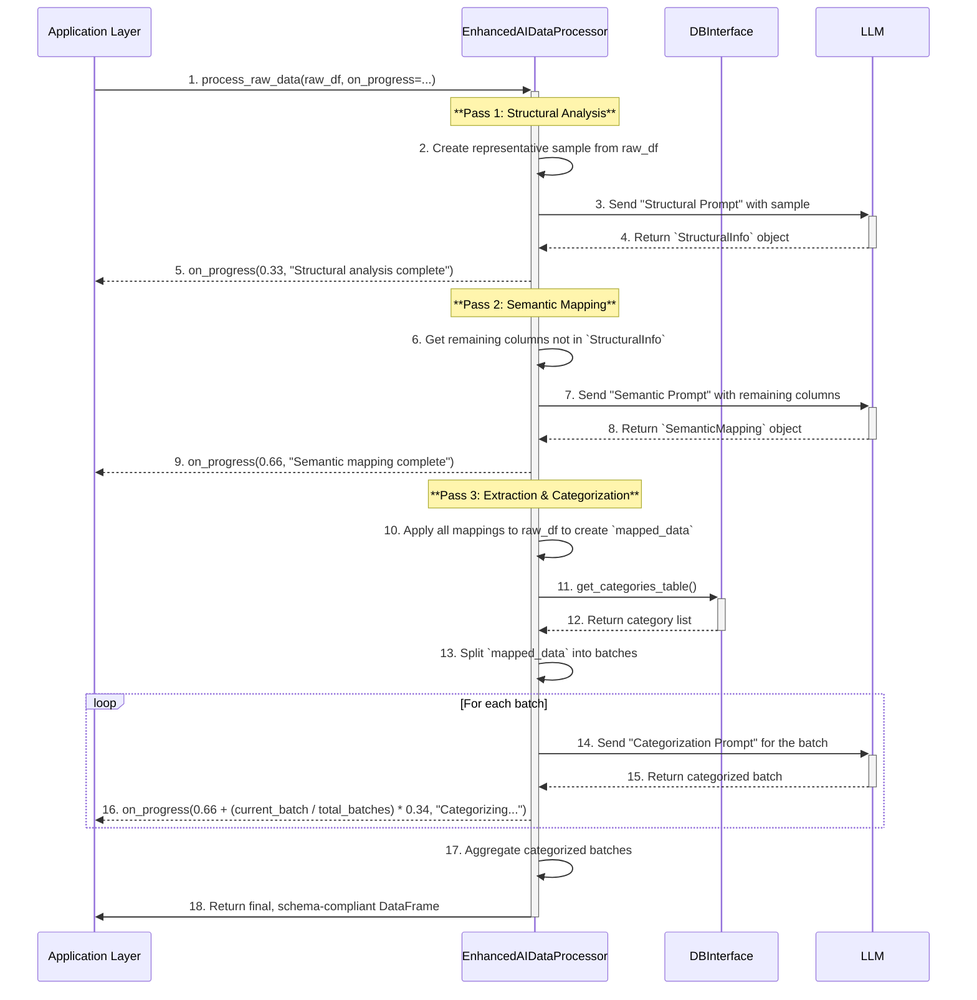

# Enhanced AI-Powered Data Processor Micro-Architecture

**Author:** AI Architect
**Date:** July 24, 2025
**Version:** 1.0

## 1. Component Overview

This document outlines the micro-architecture for the `EnhancedAIDataProcessor`. This component evolves the original `AIDataProcessor` by replacing its single-pass, monolithic LLM call with a more robust and accurate **three-pass pipeline**.

The core architectural shift is to **separate distinct reasoning tasks into sequential passes**. Instead of asking an LLM to do everything at once, this new approach uses targeted AI calls for each phase:
1.  **Structural Analysis:** An initial AI call to understand the file's machine-readable structure (dates, amount columns).
2.  **Semantic Mapping:** A second AI call to map the human-readable meaning of columns (the transaction description).
3.  **Categorization:** A final AI call to apply business logic to the clean, structured data.

This design significantly improves reliability and maintainability by using focused, simpler prompts at each stage.

## 2. Architectural Pattern

The component continues to adhere to the established and effective patterns:

1.  **Strategy Pattern:** Implements the `AbstractDataProcessor` interface, ensuring it is a plug-and-play replacement for other processors.
2.  **Decorator Pattern:** The `process_raw_data` method is wrapped by `@enforce_output_schema` to guarantee the final output DataFrame is always compliant with the application's data contract.
3.  **Callback Pattern:** It accepts an `on_progress` callback to report progress to the UI layer without creating a hard dependency.

## 3. Position in System Architecture

The processor's external position in the system is unchanged. It remains a bridge between the file parsers and the `DBInterface`. However, its internal complexity is now managed within a structured pipeline.

```
┌─────────────────────────────────────────────────────────────────┐
│                    FILE PARSERS                                 │
└─────────────┬───────────────────────────────────────────────────┘
              │ Raw pandas DataFrame (any column names/structure)
┌─────────────▼───────────────────────────────────────────────────┐
│             ENHANCED_AI_DATA_PROCESSOR COMPONENT                │
│  • Pass 1: AI-Powered Structural Analysis                       │
│  • Pass 2: AI-Powered Semantic Mapping                          │
│  • Pass 3: Pandas Extraction & AI Categorization                │
└─────────────┬───────────────────────────────────────────────────┘
              │ Standardized DataFrame (guaranteed by decorator)
┌─────────────▼───────────────────────────────────────────────────┐
│                  DB_INTERFACE COMPONENT                         │
└─────────────────────────────────────────────────────────────────┘
```

## 4. Core Responsibilities and Pass Definitions

### **Pass 1: Structural Analysis (AI)**
-   **Scope:** To identify the machine-readable, structural columns required for financial calculations.
-   **Responsibilities:**
    -   Take a representative data sample.
    -   Use an LLM to identify the column containing the transaction date and its `strftime` format.
    -   Use the LLM to determine the method used for representing transaction amounts and identify all associated columns and text identifiers.
-   **Output:** A `StructuralInfo` object.

### **Pass 2: Semantic Mapping (AI)**
-   **Scope:** To identify the human-readable column that gives purpose to the transaction.
-   **Responsibilities:**
    -   Receive the list of columns that were *not* identified in Pass 1.
    -   Use an LLM to determine which of these remaining columns best represents the transaction `description`.
-   **Output:** A `SemanticMapping` object.

### **Pass 3: Extraction (Pandas) & Categorization (AI)**
-   **Scope:** To transform the raw data and apply business logic in an efficient, batched manner.
-   **Responsibilities:**
    -   Apply the mapping rules from Pass 1 and Pass 2 to the full raw DataFrame using `pandas` to create a clean, standardized `mapped_data` dataset.
    -   Fetch the list of valid categories from the `DBInterface`.
    -   Split the `mapped_data` into smaller batches for efficient processing.
    -   For each batch, use an LLM to assign categories, providing the fetched category list as context in the prompt to constrain the output.
-   **Output:** The final, processed DataFrame.

## 5. Component Logic: The Three-Pass Model

The processor executes a sequential pipeline. The output of one pass becomes the input for the next, ensuring a clean and predictable flow.



## 6. Developer Schemas and Implementation Notes

To ensure a clear contract between passes and with the LLM, the following data structures should be used.

### **Amount Representation Enum**
This enum defines the structural patterns for transaction amounts.
```python
from enum import Enum

class AmountRepresentation(Enum):
    DUAL_COLUMN_DEBIT_CREDIT = "dual_column_debit_credit"
    SINGLE_COLUMN_SIGNED = "single_column_signed"
    SINGLE_COLUMN_WITH_TYPE = "single_column_with_type"
```

### **Pass 1: `StructuralInfo` Schema**
The LLM must return a JSON object conforming to this structure.
```json
{
  "date_info": {
    "column_name": "<column_name>",
    "format_string": "<strftime_format>"
  },
  "amount_info": {
    "representation": "<AmountRepresentation_enum_value>",
    // Required for DUAL_COLUMN_DEBIT_CREDIT
    "debit_column": "<column_name>", 
    "credit_column": "<column_name>",
    // Required for SINGLE_COLUMN_SIGNED
    "amount_column": "<column_name>",
    // Required for SINGLE_COLUMN_WITH_TYPE
    "type_column": "<column_name>",
    "debit_identifier": "<text_in_type_column>",
    "credit_identifier": "<text_in_type_column>"
  }
}
```

### **Pass 2: `SemanticMapping` Schema**
The LLM must return a simple JSON object with the name of the description column.
```json
{
  "description_column": "<column_name>"
}
```

### **Data Sampling Strategy**

To ensure the `SchemaInfo` is accurate, the initial sample will be a composite DataFrame constructed from:
1.  The first 20 rows (`raw_data.head(20)`).
2.  A random sample of 20 rows from the middle of the dataset.
3.  The last 20 rows (`raw_data.tail(20)`).

This provides a comprehensive view of headers, footers, and general data patterns.

### **Other Notes**

-   **Configuration:** Key parameters like sample sizes should be defined as configurable class-level variables.
-   **Immutability:** The original `raw_data` DataFrame should be treated as immutable. Each pass or sub-step should return a new DataFrame or data structure.
-   **Prompt Engineering:** Each pass should have a dedicated, fine-tuned prompt that asks a very specific question, avoiding the complexity of a single, monolithic prompt.
-   **Progress Update:** Sample progress update logic has been provided. But the implementation can be changed as per development needs.

## 7. Error Handling

The multi-pass design allows for more granular error handling:

-   **Pass 1 (Discovery) Failure:** If the LLM fails to return a valid `StructuralInfo` object, the process must halt and report a clear error. Processing is impossible without this information.
-   **Pass 2 (Mapping) Failure:** If the LLM cannot identify a description column, the system can log the failure and proceed by concatenating all remaining un-mapped text columns as a fallback `description`.
-   **Pass 3 (Categorization) Failure:** If a single transaction fails categorization, it will be assigned a default `"Uncategorized"` category and logged. This prevents a single row from halting the entire process.

## 8. Interface and Output Contract

A key advantage of this architecture is that the external contract remains unchanged. The complexity is entirely encapsulated within the component.

```python
# In core/processors/abstract_processor.py
from typing import Callable, Optional
import pandas as pd

class AbstractDataProcessor(ABC):
    
    @abstractmethod
    @enforce_output_schema
    def process_raw_data(
        self, 
        df: pd.DataFrame, 
        on_progress: Optional[Callable[[float, str], None]] = None
    ) -> pd.DataFrame:
        """
        Processes a raw DataFrame and returns a standardized DataFrame.
        """
        pass
```
