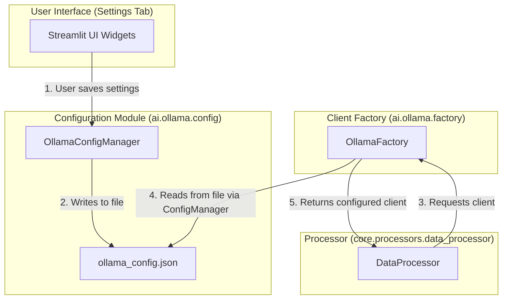

# Integration Guide: DataProcessor and Ollama Configuration

**Author:** AI Architect
**Date:** July 10, 2025

## 1. Objective

This document provides a focused guide for the developer on how to integrate the `DataProcessor` with the `ai.ollama` module, specifically concerning the flow of configuration from the Streamlit UI to the Ollama client.

The goal is to allow the user to configure the Ollama connection parameters (URL, model, etc.) in the Streamlit `Settings` tab, and have the `DataProcessor` seamlessly use a client with these settings.

## 2. Architectural Pattern: Decoupled Configuration

The key principle is that the `DataProcessor` **does not** manage configuration directly. It remains decoupled from the configuration source (the UI and the JSON file). It simply requests a pre-configured client from the `OllamaFactory`.

This separates the concerns of UI, configuration persistence, and business logic.

## 3. Component Interaction and Data Flow

The configuration flows from the user, through the config manager, to the factory, and is finally consumed by the client used in the processor.



## 4. Developer Implementation Steps

### Step 1: Implement the Settings UI

In the Streamlit **`Settings` tab**:

1.  Create UI widgets (e.g., `st.text_input`) for the Ollama parameters (`base_url`, `model`, `timeout`).
2.  When the user clicks "Save":
    *   Instantiate the `OllamaConfigManager`.
    *   Create an `OllamaSettings` object from the UI inputs.
    *   Call `config_manager.save_settings(settings_object)` to write the data to `ollama_config.json`.

**Example Snippet (for the Settings tab logic):**

```python
# In the Streamlit Settings tab file
from ai.ollama.config import OllamaConfigManager, OllamaSettings

# ... UI code for inputs ...

if st.button("Save AI Settings"):
    config_manager = OllamaConfigManager()
    new_settings = OllamaSettings(
        base_url=st.session_state.ollama_url, # Or however you get the value
        model=st.session_state.ollama_model,
        timeout=st.session_state.ollama_timeout
    )
    config_manager.save_settings(new_settings)
    st.success("Ollama settings saved!")
```

### Step 2: Update the DataProcessor

In the **`DataProcessor` class** (`core/processors/data_processor.py`):

1.  Import the factory function: `from ai.ollama.factory import get_ollama_client`.
2.  In the `__init__` method, call this function to get the client instance. The factory handles reading the configuration and creating the client correctly.

**Example Snippet (for `DataProcessor`):

```python
# In core/processors/data_processor.py
from ai.ollama.factory import get_ollama_client

class DataProcessor:
    def __init__(self):
        # The factory reads the config and gives us a ready-to-use client.
        # The processor itself doesn't know or care about the JSON file.
        self.ollama_client = get_ollama_client()
        # ... other initializations

    def process_transactions(self, dataframe):
        # ... pipeline logic ...
        # The AI categorization step can now use self.ollama_client
        # which is already configured based on what the user set in the UI.
```

By following this pattern, the `DataProcessor` remains clean and focused on its primary responsibility: processing data. It gets the tools it needs (the Ollama client) in a ready-to-use state, fully configured according to the user's settings.
